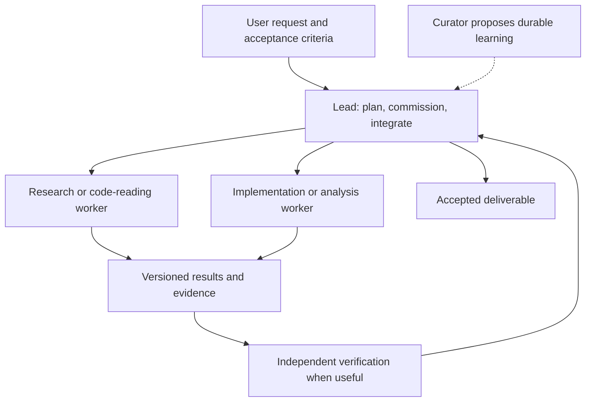
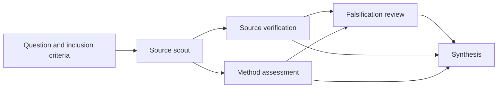
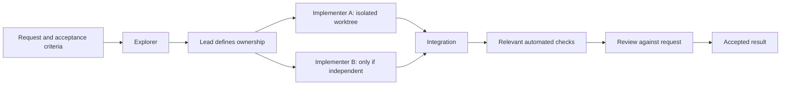

# Radian agent orchestration: research and improvement plan

Date: 13 September 2026. Status: proposal; no application or configuration changes made.

**Product feature companion:** [Advisor, Decision Committee, Fusion Partner, Fuse Proposals, and Validate and Repair](radian-collaboration-modes-plan.md). This adds the collaboration modes underdeveloped in the initial infrastructure plan and supplies their concrete protocols, interface, and delivery order. Ship bounded advisory and proposal modes early while continuing the reliability work below.

## Recommendation

Make Radian a dependable environment for a lead agent to commission, supervise, verify, and integrate bounded work. Keep Pi as the execution engine and retain Radian's existing specialists, workflow graphs, project hierarchy, and compact mathematical interface.

The highest-value sequence is:

1. Fix the capability mismatch in research workflows, offer useful Coding presets, and ship bounded Advisor, Decision Committee, and proposal-comparison/fusion modes.
2. Give every delegation the same task contract, lifecycle, capacity accounting, and result acceptance process.
3. Make interrupted work recoverable and concurrent writing predictable.
4. Deliver Fusion Partner as a persistent lead/sidekick workflow with follow-up, then expand selective communication and context retrieval.
5. Expand autonomy only when paired evaluations show better outcomes for an acceptable cost.

This is an engineering recommendation, not a claim that one architecture is universally state of the art. The evidence includes documented production features, vendor experiments, and research results with different tasks and budgets. Their scores are not directly comparable.

## Evidence and scope

Three **GPT-5.6 Luna subagents** researched orchestration, harness design, and durable execution using live web search and primary sources. The coordinating agent inspected Radian's current working tree and the default persisted harness configuration. External findings and citations are collected below.

Local baseline:

- Repository: `PCVS06/supernova`; branch `docs/graph-workflow-engineering`; base commit `b7556f05c4bb7d5ce9674717ec05ee92fcf996d6`.
- The checkout contains extensive pre-existing tracked and untracked changes, including the new delegation and workflow implementation. This assessment includes those working-tree files; the commit alone does not reproduce the assessed state.
- `apps/desktop/package.json` identifies the product as **Radian 0.2.0**. Installed Pi coding-agent dependency inspected: **0.83.0**.
- Default persisted library: `~/.config/pi-plus/harnesses.json`, **revision 25** at inspection. A server started with a custom `SUPERNOVA_HOME` can use a different library; existing chats also retain pinned snapshots.
- Findings below are source/configuration observations and explicitly marked inferences. No paid agent benchmark, crash experiment, or new native UI acceptance test was run. Previous implementation reports are historical evidence, not newly reproduced test results.

## Current state of the art: what is supported by evidence

All sources below were accessed on **13 September 2026**. A documentation access date is not a publication date. The most recent dated multiagent study included is from **13 August 2026**; current product documentation supplies the capability snapshot.

### Patterns and product capabilities

| Capability                                 | Primary evidence and maturity                                                                                                                                                                                                                                                                                                                                                                                                                                                                        | Implication for Radian                                                                                                                                                               |
| ------------------------------------------ | ---------------------------------------------------------------------------------------------------------------------------------------------------------------------------------------------------------------------------------------------------------------------------------------------------------------------------------------------------------------------------------------------------------------------------------------------------------------------------------------------------- | ------------------------------------------------------------------------------------------------------------------------------------------------------------------------------------ |
| Parent-controlled specialists              | Anthropic's [multi-agent research system](https://www.anthropic.com/engineering/multi-agent-research-system), 13 June 2025, uses a lead, separate worker contexts, parallel research, and citation processing. It reports a 90.2% improvement on its internal research evaluation, with substantially greater token consumption. This is a vendor result with a particular model/workload setup, not an equal-cost Radian comparison.                                                                | Make assignments explicit and return compact evidence. Delegate only when independent exploration or context isolation adds value.                                                   |
| Packaged subagent profiles                 | Current [Claude Code subagents](https://code.claude.com/docs/en/sub-agents) document separate contexts, prompts, tools, permissions, models, background execution, memory, and hooks. Current [Codex subagents](https://learn.chatgpt.com/docs/agent-configuration/subagents) document parallel specialists, configuration inheritance, concurrency controls, and model specialization, including Luna for bounded work. These are supported features, not comparative performance evidence.         | A role should own a capability/context profile, not merely a name and prompt. Preserve inheritance and make effective configuration inspectable.                                     |
| Manager calls versus handoffs              | The [OpenAI Agents SDK](https://openai.github.io/openai-agents-python/agents/) distinguishes a manager invoking an agent as a tool from a handoff that transfers conversational control. [Handoff input filters](https://openai.github.io/openai-agents-python/handoffs/) control inherited history.                                                                                                                                                                                                 | Keep specialist delegation under the lead. Add conversational handoff only if transferring ownership solves a real user flow.                                                        |
| Explicit graph orchestration               | [LangChain's multi-agent patterns](https://docs.langchain.com/oss/python/langchain/multi-agent) distinguish subagents, routers, handoffs, and custom workflows. [Google ADK workflow documentation](https://github.com/google/adk-docs/blob/main/docs/workflows/index.md) describes composable workflow patterns. These provide deterministic coordination around model calls.                                                                                                                       | Retain the DAG for known dependencies; use dynamic routing for uncertain assignments. Avoid rebuilding fixed dependencies through repeated LLM planning.                             |
| Long-running generation and evaluation     | Anthropic's [long-running application harness](https://www.anthropic.com/engineering/harness-design-long-running-apps), 24 March 2026, uses explicit deliverables, structured handoffs, and a separate evaluator exercising the app. It also finds some scaffolding becomes unnecessary as the model improves. This is an engineering case study with task and budget differences.                                                                                                                   | Define acceptance before delegation. Use independent verification where it catches consequential failures, and measure its overhead.                                                 |
| Durable state independent of execution     | Anthropic's [Managed Agents architecture](https://www.anthropic.com/engineering/managed-agents), 8 April 2026, separates the durable session log, replaceable harness, and execution sandbox. [LangGraph persistence](https://docs.langchain.com/oss/python/langgraph/persistence) separates checkpoints from cross-thread stores.                                                                                                                                                                   | Separate Radian's saved task state, Pi execution session, and workspace. A lost worker must not mean lost task ownership or evidence.                                                |
| Explicit recovery and interrupts           | [LangGraph interrupts](https://docs.langchain.com/oss/python/langgraph/interrupts) persist pauses; the interrupted node starts again on resume, so earlier effects need care. [Temporal architecture](https://github.com/temporalio/temporal/blob/main/docs/architecture/README.md) separates deterministic workflow replay from Activities. [AWS durable-execution guidance](https://docs.aws.amazon.com/durable-execution/patterns/best-practices/idempotency/) explains retry/idempotency limits. | Durable pauses and retry policies belong in the execution model. Stable IDs and saved state alone cannot guarantee exactly-once external effects.                                    |
| Isolated workspaces and explicit authority | [Codex worktrees](https://learn.chatgpt.com/docs/environments/git-worktrees) provide isolated parallel Git work. [Codex sandboxing](https://learn.chatgpt.com/docs/sandboxing) distinguishes technical execution boundaries from approval policy.                                                                                                                                                                                                                                                    | Track workspace identity, execution capabilities, and existing authorization separately. A tool allowlist is not an OS sandbox.                                                      |
| Context engineering and retrievable state  | [Anthropic context engineering](https://www.anthropic.com/engineering/effective-context-engineering-for-ai-agents), 29 September 2025, discusses selective context, compaction, and specialist contexts. [OpenAI compaction](https://developers.openai.com/api/docs/guides/compaction) includes provider-managed opaque state; [Skills](https://developers.openai.com/api/docs/guides/tools-skills) support progressive access to procedural resources.                                              | Keep a durable human-readable task/artifact record alongside provider context. Reuse Pi's compaction and resource mechanisms; do not interpret opaque provider state.                |
| Tracing and evaluation                     | The [Agents SDK](https://openai.github.io/openai-agents-python/) supports tracing across calls, tools, and handoffs. [Agents API observability](https://developers.openai.com/api/docs/guides/agents-api/observability) documents lifecycle/usage visibility and caveats around delayed, best-effort usage. [OpenAI Evals](https://developers.openai.com/api/reference/java/resources/evals/methods/create) provides criteria-driven grading.                                                        | Extend existing receipts with causal IDs, acceptance evidence, and explicitly incomplete accounting. Measure outcomes as well as execution traces.                                   |
| Peer teams                                 | [Claude Code agent teams](https://code.claude.com/docs/en/agent-teams) document teammate messaging and shared coordination, but are experimental and have lifecycle limitations.                                                                                                                                                                                                                                                                                                                     | Add scoped follow-up messaging before a general team chat or a decentralized organization. Treat this as an optional mode.                                                           |
| Agent and tool interoperability            | The [A2A specification](https://github.com/a2aproject/A2A/blob/main/docs/specification.md) defines agent task/status/artifact exchange. [MCP architecture](https://modelcontextprotocol.io/specification/2025-06-18/architecture), cited at that specific specification version, defines host/client/server capability boundaries.                                                                                                                                                                   | MCP connects tools; A2A connects independently deployed agents. Neither replaces local scheduling, recovery, or authorization. Recheck specification versions before implementation. |
| Extensible runtime foundation              | The current [Pi SDK](https://pi.dev/docs/latest/sdk), [extensions](https://pi.dev/docs/latest/extensions), and [session format](https://pi.dev/docs/latest/session-format) provide embedded sessions, tools/hooks, and persisted event-tree primitives.                                                                                                                                                                                                                                              | Keep Pi. Radian should own the product-level task contract, supervision, budgets, workspace policy, and navigation around it.                                                        |

### What the empirical work says about adding more agents

**Task structure matters more than agent count.** The current v3 of [Towards a Science of Scaling Agent Systems](https://arxiv.org/abs/2512.08296v3), revised **8 April 2026**, studies 260 configurations across six benchmarks. Reported relative changes range from **+80.8%** on decomposable financial reasoning to **−70.0%** on sequential planning. It finds diminishing returns when a single agent is already capable, overhead on tool-heavy tasks, and more error propagation without centralized verification. These are benchmark-specific findings; they do not establish Radian's expected gain.

**Large teams can produce more activity without a better deliverable.** Anthropic's [Patterns and problems in emerging multiagent systems](https://www.anthropic.com/research/multiagent-systems), **13 August 2026**, studies coordinated vulnerability discovery, collaborative coding, and other interactions. Its vulnerability comparison changes both token budget and search scope; restricting scope makes the apparent efficiency advantage much less clear. The coding experiments expose integration problems, conformity, and premature consensus. This supports testing accepted outputs and preserving disagreement, rather than treating agent count, PR count, or agreement as quality.

**Recommendation derived from these sources:** Use a lead with bounded specialists and deterministic checks as Radian's default. Add parallelism for independent evidence collection and isolated implementation. Keep sequential work together. Treat richer peer coordination as an experiment that must outperform that baseline.

## What Radian already has

| Area                   | Observed implementation                                                                                                                                                                                     | What to preserve                                               |
| ---------------------- | ----------------------------------------------------------------------------------------------------------------------------------------------------------------------------------------------------------- | -------------------------------------------------------------- |
| Delegation             | `subagent` supports one task, sequential chains, synchronous parallel batches, and background `start/status/wait/cancel`. Background batches reserve up to three workers per chat and return saved run IDs. | Explicit delegation and bounded fan-out.                       |
| Agent identity         | Harness and project instructions, specialist role prompts, tools, skills, model and reasoning overrides; chat configuration snapshots.                                                                      | Real capability/context separation behind the visual roles.    |
| Hierarchy              | A head can delegate to registered labs through `lab_agent`; specialists cannot recursively delegate.                                                                                                        | Bounded depth and project-scoped responsibility.               |
| Workflows              | Acyclic dependencies, separate `reads` and `dependsOn`, shared validated outputs, parallel capacity from one to six, per-step states and attempts.                                                          | The existing DAG scheduler and typed boundaries.               |
| Failure handling       | Failed workflow branches block dependents while independent work can finish; completed steps survive manual resume; external-effect retries require an explicit flag.                                       | Partial progress and conservative replay semantics.            |
| Resource controls      | Worker turn/time limits and a wind-down message; optional workflow/step cost limits, in-flight reservations, cumulative workflow time.                                                                      | Server-side controls rather than instructions alone.           |
| Persistence            | Atomic receipt replacement, compact summary files, public worker transcripts, parent run IDs, PID-based interruption detection.                                                                             | Saved evidence and lazy loading of detail.                     |
| Workspace coordination | A canonical-path, process-wide reader/writer lease serializes workflow writers against other participating workflow work.                                                                                   | A safe baseline for shared-directory workflow steps.           |
| Context and memory     | Pi compaction, explicit resource loading, instruction versions, runtime context receipts, curator proposals and an append-only scientific-memory ledger.                                                    | Existing provenance and review mechanisms.                     |
| UI                     | Recorded delegation branches, workflow graphs, worker result views, and a shared workspace overview.                                                                                                        | Quiet defaults, real statuses, and results before transcripts. |

The source map at the end links these observations to implementation files. Radian already contains much of the visible feature set associated with capable agent harnesses. The main gaps concern consistency, recovery, and the usefulness of the configured agents.

## Highest-impact gaps in this installation

### 1. The available engine exceeds the configured workflows

**Observed:** Coding has no configured specialists or workflows. Science Pi has 13 specialist definitions, but its saved `literature-review` workflow is a four-step chain: scout → method → falsify → synthesis. `maxParallel` and a workflow dollar limit are absent; execution defaults to one concurrent step. Both harnesses use 40 turns and 900 seconds per worker. The saved library has one Science-Space project and no child labs.

**Implication:** Adding another graph editor or more agent titles would have limited immediate value. Configure useful workflows and expose when a feature has no configured workers. Do not infer that every existing chat uses the latest library.

**Action:** Offer selectable Coding and Research presets with previewable prompts, tools, and budgets. Keep existing user-authored configurations intact. Make activation explicit through the existing configuration UI; do not silently rewrite pinned chats.

### 2. Read-only research workflows lose their research tools

**Observed:** `harness-runtime.ts:30,250` intersects workflow workers' tool lists with `read`, `grep`, `find`, `ls`, and `web_fetch` for `effects: "none"`. The persisted literature scout has `research_literature_search`, `research_paper_resolve`, and scientific-memory tools, but no `web_fetch`. Those research tools are therefore removed in the saved workflow. Pi 0.83.0 applies the supplied allowlist to extension/custom tools too.

**Implication:** The scout is reduced to filesystem reading/searching in this path. A structured result can look valid while the worker lacks the capability to obtain the intended evidence. This is a source-level consequence, not a newly executed failing workflow.

**Action:** Replace the name-based read-only list with an explicit tool capability catalog. Distinguish reads, local cache writes, project artifact writes, arbitrary shell execution, and external mutations. Inspect each research tool's real effects before classifying it: a search tool may write a cache. Validate required tools after resource loading and fail before starting if a role cannot fulfill its assignment. Do not fix this by granting unrestricted shell access.

### 3. Ad hoc and workflow work follow different operational rules

**Observed:** Synchronous parallel specialist execution cancels siblings on a failure; background workers isolate sibling failures. Workflow writers use the workspace lease; ad hoc workers do not acquire that lease. Cost controls and structured usage are implemented for workflow steps, while `HarnessRun` has no dedicated usage/budget fields. Background capacity is tracked in an in-memory map per chat.

**Action:** Retain the distinct user-facing modes, but route them through common lifecycle, workspace, accounting, and result services. Make failure policy an explicit property of a task group: independent work may finish; an all-or-nothing group may cancel siblings. Apply parent budget and capacity limits across nested lab calls as well as named workflows.

### 4. Saved receipts are not resumable worker execution

**Observed:** Workers use `SessionManager.inMemory(...)`. The run store can mark a dead writer's receipt interrupted, and workflows can rerun unfinished steps, but this does not restore an ad hoc worker's full execution session. Background `wait` joins in-memory promises; it cannot resurrect a dead process. PID liveness alone does not establish that a particular run still has a valid owner.

**Action:** Persist worker sessions where continuation is supported, plus a durable task journal and explicit recovery decisions. Separate “continue this session,” “retry this task,” and “fork a new attempt.” Store an owner-instance ID and lease heartbeat; reconcile after restart. Recovery must not reissue uncertain external actions.

### 5. File ownership is mostly advisory outside workflows

**Observed:** Worker prompts demand separate ownership, but ad hoc workers use the project's working directory. The workflow lease coordinates participating steps inside one process; it does not isolate them from an ad hoc writer, another server, a user edit, or an arbitrary shell command.

**Action:** Route Radian-managed shared-workspace writes through one coordination boundary. Offer isolated Git worktrees for parallel implementation, with a dedicated integration step and validation on the combined result. Keep shared-directory writers serialized until isolation is available. Worktrees prevent accidental overlap; they are not a security sandbox or a guarantee that patches will merge correctly.

### 6. A completed response is not an accepted deliverable

**Observed:** Specialist completion is based on the last assistant response finishing successfully. Workflow outputs receive local structural validation, limited to flat strings, numbers, booleans, and string arrays. The contract does not prove that cited sources support claims, a patch meets the request, or a reported test passed.

**Action:** Keep execution status separate from acceptance status. Add `pending_review`, `accepted`, and `changes_requested` as an independent result dimension, with evidence links and concrete validation results. A reviewer can recommend acceptance; deterministic checks and the parent/user's actual acceptance rule decide it.

### 7. External action identity is present, but enforcement is incomplete

**Observed:** Workflow steps have stable action IDs, and the prompt asks agents to pass them to external actions. `allowExternalRetry` blocks uncertain retries by default, but it is a model-callable boolean, not a saved authorization record or a tool-adapter idempotency guarantee.

**Action:** Persist action intent before dispatch and the external receipt afterward. Enforce idempotency at adapters that support it. For unknown outcomes, require reconciliation; when an action actually requires user approval, bind that approval to the concrete action and input digest. Preserve existing authorization for already authorized actions. Never label this “exactly once” for arbitrary shell commands or external systems.

### 8. Context checks and run identity need a fuller manifest

**Observed:** There are instruction-size limits and a worker-side character-based token estimate. That estimate covers appended instructions; it is not a complete accounting of the assembled prompt, tool schemas, task, results, and response reserve. Context/planning files are read when resources load, even though chat configuration and workflow definitions are pinned.

**Action:** Build a run manifest with effective configuration, model/effort, tool/skill versions, context hashes, workspace base revision, and source artifact IDs. Show a token breakdown and missing capability warnings before launch. Keep large evidence outside the prompt, retrieve relevant portions, and retain a pointer to the original after compaction.

### 9. Communication and scheduling stop short of a durable team

**Observed:** Ad hoc workers support inspection and cancellation, but the tool schema has no follow-up message or reusable worker continuation. `wait` waits for the selected live jobs; there is no bounded wait-for-first-result/cursor contract. Background results are deliberately not injected into the parent conversation automatically.

**Action:** Add typed, persisted messages and bounded event waits before open peer-to-peer chat. The lead should be able to answer a worker's question, narrow scope, request a correction, or consume the first useful result. Keep automatic parent wake-up opt-in and coalesced; idle UI updates should not generate paid model turns.

### 10. Existing observability should become actionable

**Observed:** Public transcripts, receipts, compact summaries, revisions, and shared workspace data already exist. Worker/workflow hooks poll around 1.2–1.5 seconds while active; workspace overview polling is two seconds while active. Some list paths enumerate historical receipt summaries.

**Action:** Extend the shared read model with blocked reason, budget remaining, ownership, unreviewed outputs, and next action. Add cursor-based run events with snapshot reconciliation if measured load justifies it. Index history and paginate results. Do not create a second task database inside the map or add unmeasured token-savings animations.

## Target organization

Use a small stable hierarchy with temporary task teams:

The hierarchy expresses responsibility. The workflow graph expresses task dependencies. The workspace map expresses navigation. Keep these concepts distinct even when they share visual components.

| Role                      | Responsibility                                                                               | Default authority                                                                   | Launch when                                      |
| ------------------------- | -------------------------------------------------------------------------------------------- | ----------------------------------------------------------------------------------- | ------------------------------------------------ |
| Lead                      | Interpret the request, assign non-overlapping work, handle uncertainty, integrate and report | Existing project authority; explicitly bounded delegation                           | One per user task                                |
| Explorer / source scout   | Gather evidence and locate relevant code                                                     | Read capabilities plus scoped retrieval                                             | A bounded question can be answered independently |
| Implementer / analyst     | Produce a patch, analysis, or experiment artifact                                            | Assigned workspace or isolated worktree; task-specific tools                        | A concrete deliverable and acceptance rule exist |
| Reviewer / verifier       | Check the artifact against sources, requirements, and observed checks                        | Read the artifact; execute approved validation in an isolated environment if needed | Risk or complexity merits a separate pass        |
| Curator                   | Propose reusable lessons from accepted results and user corrections                          | Existing proposal/review mechanism                                                  | Evidence supports a durable improvement          |
| Cross-project coordinator | Allocate work to known project leads                                                         | Explicit project scopes and a shared budget                                         | The user task actually spans projects            |

Preserve the 13 Science roles as selectable specializations; do not activate all of them for each task. Keep the current specialist recursion boundary. Add depth only for a measured cross-project use case. Independent review should preserve contrary evidence rather than collapse into a majority vote.

## Proposed execution contract

Introduce a shared serializable `TaskAssignment` and `TaskResult` in `packages/contracts`, consumed by ad hoc delegation and workflow steps. These are proposed contracts, not existing APIs.

| Assignment fields                                         | Purpose                                                             |
| --------------------------------------------------------- | ------------------------------------------------------------------- |
| `taskId`, `parentTaskId`, `groupId`, `attemptId`          | Stable logical ownership, grouping, and separate execution attempts |
| Objective, scope, non-goals, acceptance criteria          | A worker can determine what counts as completion                    |
| Agent definition/version, selected model and effort       | Reproducible and explainable routing                                |
| Input artifact references and context manifest            | Targeted, versioned handoffs                                        |
| Capability policy, workspace identity, ownership, effects | Enforceable operating scope                                         |
| Time/token/cost limits and parent reservation             | Admission control and bounded execution                             |
| Failure policy, dependency policy, join policy            | Predictable group behavior                                          |

| Result fields                                                        | Purpose                                              |
| -------------------------------------------------------------------- | ---------------------------------------------------- |
| Summary, artifact references and content hashes                      | A compact answer with inspectable underlying work    |
| Sources, claims, uncertainties, unresolved questions                 | Traceable research rather than unsupported synthesis |
| Validation evidence: command/check, result, scope, artifact revision | Separate “reported” from “observed” success          |
| Execution status and separate acceptance status                      | Finishing a turn does not imply task acceptance      |
| Usage, estimated/unpriced components, elapsed time                   | Honest accounting across all paths                   |
| Changed files, workspace base, integration state                     | Safe review and merge                                |

Use one server-owned task dispatcher around the existing Pi worker path. Keep orchestration-specific scheduling outside Pi's model/tool loop. Implement narrow Effect services for run storage, admission/budgets, workspace access, and result delivery; do not introduce a second agent framework merely to obtain its branding.

## Delivery roadmap

Effort bands are planning estimates for one engineer familiar with this repository, before native acceptance and unexpected integration work: **S = 1–3 days, M = 4–8 days, L = 2–3 weeks**. They are not promises of agent execution time. Re-estimate after the first capability and recovery spike.

### Phase 0 — Make the existing system useful and measurable

**Priority P0 · S–M · no dependency**

- Add a loaded-tool capability report and preflight required-tool validation; repair the research workflow's capability filtering with explicit effect metadata.
- Offer a Coding preset: explorer, implementer, reviewer. Offer a Research preset that reuses existing roles.
- Ship one-shot Advisor and fixed-round Committee/proposal-fusion protocols on the existing worker/DAG paths, following the companion feature plan. Full crash continuation is not a prerequisite for these bounded advisory modes.
- Set explicit workflow budgets through configuration. Explain inherited limits and the absence of a dollar limit.
- Prepare a small evaluation corpus and capture the current single-agent and configured-workflow baselines before broader changes.

**Acceptance:** A literature scout can actually call an approved retrieval tool in its workflow; a disallowed mutation is rejected. A Coding preset can produce and independently inspect a small artifact. Existing chats retain their pinned configuration. The initial benchmark has reproducible inputs and recorded costs.

### Phase 1 — Common task contract, accounting, and safe shared writes

**Priority P0 · M · depends on Phase 0**

- Extract the shared worker lifecycle from `harness-runtime.ts`; keep the DAG scheduler in `workflow-runner.ts`.
- Persist typed assignments/results and usage for every worker, including nested lab calls.
- Add one server-wide admission queue with configurable provider, project, chat, and parent-run limits. Reserve capacity and budget before dispatch; release both on terminal outcomes and recovery.
- Use the same workspace coordination service for every participating Radian writer. Preserve explicit group failure policies.
- Start with current small concurrency settings. Display queued work and its reason instead of increasing limits indiscriminately.

**Acceptance:** Several chats cannot bypass the configured global capacity; a nested call cannot create a new independent budget. Synchronous/background modes apply the selected failure policy consistently. A shared-workspace workflow and ad hoc writer cannot race through separate Radian paths. Unpriced usage is visible as unknown, not zero.

### Phase 2 — Durable continuation and external action reconciliation

**Priority P0 · L · depends on Phase 1**

- Persist worker sessions and a versioned journal of assignment, attempt, state transition, and result.
- Replace PID-only ownership decisions with run-owner instance IDs, leases, and restart reconciliation.
- Make summary indexes rebuildable from authoritative records. Preserve the current compact UI projections.
- Support explicit continue/retry/fork semantics. Pin the effective role and resource manifest; detect drift before resuming against changed files or extensions.
- Add an external action ledger and adapter-specific reconciliation. Preserve uncertain outcomes for review.

**Acceptance:** Kill and restart the server after assignment, after tool intent, after a tool response, and after result persistence. No accepted task silently disappears; completed workflow branches remain complete; each unfinished task exposes a valid recovery choice. Duplicate delivery does not create duplicate attempts. An uncertain external action is never automatically repeated.

### Phase 3 — Isolated implementation and artifact acceptance

**Priority P1 · M–L · depends on Phases 1–2**

- Provision Git worktrees only for tasks that need independent writes; retain explicit handling for dirty base checkouts, shared dependencies, secrets, build outputs, and non-Git projects.
- Store patch/artifact lineage and ownership. Integrate through one controlled step; run relevant checks on the combined result.
- Introduce the independent acceptance dimension, structured review findings, and bounded rework requests.
- Keep schema validation local; add nested artifact/source records where needed rather than embedding large JSON strings in string fields.

**Acceptance:** Two independent implementation tasks can run concurrently in separate worktrees. A conflict becomes visible integration work; it is not silently resolved by overwriting. A passing worker check cannot mark a failing combined build accepted. Cancellation retains inspectable partial artifacts.

### Phase 4 — Selective communication, context, and model routing

**Priority P1 · M–L · depends on Phases 1–3**

- Add durable `message`, `request_input`, and `follow_up` operations scoped to the task relationship, plus wait-for-first/wait-for-all with timeout and cursor.
- Deliver completion events through a durable inbox. Default to explicit collection; allow a configured parent wake-up policy with deduplication and a turn/cost budget.
- Compile role-specific context; expose the manifest and token estimate; fetch large evidence by reference. Test that compaction retains acceptance criteria and unresolved work.
- Route bounded retrieval/extraction work to a cheaper configured model, then escalate on predefined evidence gaps or failed acceptance. Keep final integration with the appropriate lead. Treat model choice as configurable and benchmarked rather than fixed to a fashionable model name.

**Acceptance:** A worker question reaches the parent once; a follow-up preserves task identity and creates a distinct attempt when appropriate. Reconnection does not replay a completion as a new paid turn. Evidence remains retrievable after compaction. Routing improves the cost/quality tradeoff on the local evaluation set.

### Phase 5 — Quiet operational UI and controlled learning

**Priority P2 · M · depends on stable task events and acceptance**

- Extend existing run views with assignment, ownership, budget, waiting reason, result acceptance, and the relevant next action.
- Reuse the workspace overview; add event subscriptions and indexed history only after profiling the polling path.
- Extend the curator to propose reusable lessons from accepted evidence. Preserve proposal review, scope, provenance, supersession, and the existing limits on irreversible memory transitions.
- Add optional reusable workflow templates and dynamic fan-out only where repeated task patterns justify them.

**Acceptance:** A user can answer “who is doing what, why is it waiting, what changed, and what needs me?” from the compact UI. Stale state is identified. No navigation state becomes a second execution authority. Curator changes can be traced to accepted evidence and reviewed before changing shared instructions.

## Two workflows to implement first

### Research: gather once, inspect independently, synthesize with evidence

The scout creates a versioned source set once. Verification and method assessment consume the same artifact and can overlap. The falsifier receives both results. Synthesis explicitly records disagreements and missing evidence. For a simple factual lookup, use the lead plus retrieval tools instead of this entire workflow.

### Coding: investigate, implement with ownership, validate the integrated result

Use one implementer for tightly coupled edits. A second implementer is conditional, not a mandatory extra role. Review the exact integrated artifact revision. Request rework through a bounded task transition with a clear defect, rather than an unlimited critic loop.

## Evaluation and release gates

Use a paired pilot of approximately **30 representative tasks**: 10 code investigations, 10 implementation/fix tasks, and 10 research/synthesis tasks. This is a proposed starting sample, not statistical proof. Repeat noisy cases and expand the sample before asserting small improvements.

Compare the same model, tools, inputs, acceptance rubric, and budget across single-agent, current Radian, and proposed orchestration configurations. Evaluate cheaper-worker routing separately so model and orchestration effects are not confused. Keep a held-out set for curator/prompt changes.

| Measure                                                        | What it reveals                                                  |
| -------------------------------------------------------------- | ---------------------------------------------------------------- |
| Accepted task completion                                       | Whether the user request was actually satisfied                  |
| Evidence/requirement coverage                                  | Missing sources, unsupported claims, omitted acceptance criteria |
| Total cost and tokens, including failed attempts and reviewers | The real cost of delegation                                      |
| Wall-clock time and queue time                                 | Useful parallelism versus waiting and contention                 |
| Rework and integration failures                                | Whether division of labor creates more downstream work           |
| Duplicated tool work and context volume                        | Whether agents repeat research or broadcast unnecessary context  |
| Recovery success and duplicated side effects                   | Reliability under interruption                                   |
| User interventions                                             | Whether autonomy reduces or merely relocates user effort         |

**Proposed decision rule:** Keep delegation for a task category when it improves acceptance materially, or reduces median latency by at least 20% at comparable acceptance and within the selected budget. Treat 20% as a product target to validate, not a literature result. Safety/correctness invariants—no unauthorized effect, no lost accepted task, no silent ownership conflict—must pass independently of aggregate scores.

Run relevant behavior and failure tests during implementation, plus repository checks from the root: `bun run test`, `bun run typecheck`, `bun run lint`, and `bun run prettier`. Native acceptance must cover background work with an idle lead, cancel, restart/reconnect, result review, and preserved reading/navigation state. Component tests and historical reports do not replace this acceptance.

## Defer until evidence justifies the complexity

- A large permanent agent organization or mandatory CEO/manager hierarchy for every task.
- Unlimited recursive delegation and broadcast messaging.
- A rewrite into LangGraph, Temporal, or another framework; first implement narrow services around Pi, then reconsider only if recovery requirements exceed the local design.
- Arbitrary cyclic workflows, unbounded or default-on debate, and self-modifying shared prompts. Bounded, explicitly invoked committees and proposal fusion are early product features, as defined in the companion plan.
- Cross-run semantic caching without input, source freshness, permissions, configuration, and workspace revision validation.
- A2A-based federation before there is a concrete remote-agent integration requirement.
- An always-on graph dashboard or claims of saved tokens without a measured baseline.

## Implementation source map

Line numbers refer to the inspected working tree and may move during ongoing work.

| Source                                                                                                                                                                                                                                                                                | Relevant evidence / implementation seam                                                                                                                                                             |
| ------------------------------------------------------------------------------------------------------------------------------------------------------------------------------------------------------------------------------------------------------------------------------------- | --------------------------------------------------------------------------------------------------------------------------------------------------------------------------------------------------- |
| [Harness runtime](../../packages/agent-runtime/src/layers/harnesses/internal/harness-runtime.ts)                                                                                                                                                                                      | Lines 30 and 250: tool filtering; 79–151: resources and prompts; 236–249: context estimate/in-memory workers; 262 onward: usage; 387 onward: parallel/background modes; 447 onward: delegation API. |
| [Background ownership](../../packages/agent-runtime/src/layers/harnesses/internal/background-delegations.ts)                                                                                                                                                                          | In-memory capacity, acknowledgements, waits, and cancellation.                                                                                                                                      |
| [Workflow runner](../../packages/agent-runtime/src/layers/harnesses/internal/workflow-runner.ts)                                                                                                                                                                                      | Local output validation, action IDs, resume, workspace access, budget reservations, and DAG dispatch.                                                                                               |
| [Workspace lease](../../packages/agent-runtime/src/layers/harnesses/internal/workflow-workspace-lease.ts)                                                                                                                                                                             | Process-local coordination of participating workflow readers/writers.                                                                                                                               |
| [Run store](../../packages/agent-runtime/src/layers/harnesses/internal/harness-run-store.ts)                                                                                                                                                                                          | Atomic receipts and summaries, PID recovery, in-process execution ownership, history scans.                                                                                                         |
| [Harness store](../../packages/agent-runtime/src/layers/harnesses/internal/harness-store.ts)                                                                                                                                                                                          | Revision-checked configuration, instruction versions, project/lab resolution, pinned chat snapshots, default storage location.                                                                      |
| [Harness configuration](../../packages/agent-runtime/src/layers/harnesses/lib/harness-config.ts)                                                                                                                                                                                      | Defaults, scientific workflow template, graph validation, project overrides.                                                                                                                        |
| [Harness contracts](../../packages/contracts/src/harnesses/schemas/harness.ts) and [workflow contracts](../../packages/contracts/src/harnesses/schemas/workflow.ts)                                                                                                                   | Role definitions, result status, usage fields, flat handoff schemas, frozen workflow definition.                                                                                                    |
| [Session factory](../../packages/agent-runtime/src/layers/session-runtime/internal/pi-agent-session-factory.ts)                                                                                                                                                                       | Pi session construction, effective context capture, custom tool registration.                                                                                                                       |
| [Curation decisions](../../packages/agent-runtime/src/layers/curator/curator-decisions.ts) and [memory ledger](../../packages/agent-runtime/src/layers/curator/lib/memory-ledger.ts)                                                                                                  | Existing reviewed changes, provenance, terminal memory states and rollback boundaries.                                                                                                              |
| [Delegation graph](../../packages/web/src/features/harnesses/components/delegation-graph.tsx)                                                                                                                                                                                         | Parent-linked actual runs and status-driven presentation.                                                                                                                                           |
| [Worker queries](../../packages/web/src/features/harnesses/hooks/api/use-harness-runs.ts), [workflow queries](../../packages/web/src/features/harnesses/hooks/api/use-workflow-runs.ts), [workspace query](../../packages/web/src/features/workspace/hooks/use-workspace-overview.ts) | Existing polling, shared read model, and lazy receipt loading.                                                                                                                                      |

The first implementation decision should be made after Phase 0: adopt the tool-capability model and retain the current Pi-based runtime. Reassess the storage design after a bounded crash-recovery spike, and reassess deeper delegation after the paired task evaluation. These gates keep architectural commitments tied to observed needs.
