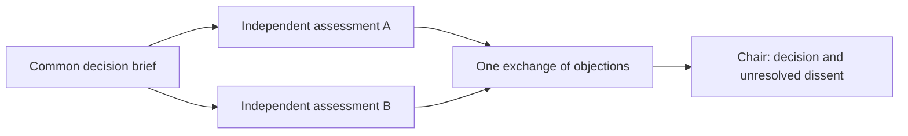

# Radian: Advisor, Committee, Fusion, and collaboration modes

Date: 13 September 2026. Proposal; nothing installed or implemented.

Companion to the [orchestration improvement plan](radian-agent-orchestration-improvement-plan.md). This document supplies the product feature layer that the first plan underemphasized. Infrastructure should support these experiences; inexpensive, bounded advisory modes can ship before the complete durability roadmap.

## Product recommendation

Make collaboration a first-class action inside a Radian task:

- **Ask Advisor:** get a second opinion without handing over the task.
- **Decision Committee:** independently assess alternatives and produce a reasoned decision with dissent preserved.
- **Fusion Partner:** a capable lead and a cheaper execution partner work through briefs, results, and feedback.
- **Fuse Proposals:** combine independently developed approaches into a coherent, validated result.
- **Validate and Repair:** define acceptance checks, build, verify, and repair within a fixed budget.

These are different working methods, each with its own inputs, outputs, and stopping rule. Giving several agents role names does not implement them.

## What “Fusion” means in current projects

The name covers multiple patterns. Keep them distinct in Radian.

| Reference                                                                                              | What the source documents                                                                                                                                                                                                                                                                                         | Evidence boundary                                                                                                                                                                                                  |
| ------------------------------------------------------------------------------------------------------ | ----------------------------------------------------------------------------------------------------------------------------------------------------------------------------------------------------------------------------------------------------------------------------------------------------------------- | ------------------------------------------------------------------------------------------------------------------------------------------------------------------------------------------------------------------ |
| [disler/fusion-harness](https://github.com/disler/fusion-harness)                                      | The current README describes 2–5 model slots and Opinion, Fusion, Debate, Collaborate, direct routing, and validation commands. Opinion/debate participants read; fusion has a sole writer; collaboration produces a dependency graph. It also describes result synchronization and a cross-process writer lease. | A concrete Pi extension reference. Search snippets still describe an older two-model version. This review uses the live README, not that older summary; its implementation and benchmarks were not locally tested. |
| [Cognition: Fusion in Devin Desktop & CLI](https://cognition.com/blog/local-fusion), 11 September 2026 | A frontier lead owns planning, ambiguity, and review; a cheaper sidekick implements and tests. They maintain separate persistent contexts and exchange briefs/results/feedback.                                                                                                                                   | Product architecture plus vendor-published benchmark comparisons. Some task scores decrease while costs decrease; there is no universal quality or savings guarantee for Radian.                                   |
| [@jonibr/pi-fusion](https://pi.dev/packages/@jonibr/pi-fusion)                                         | A Pi lead/sidekick extension with `delegate` and `follow_up`; a follow-up continues the same task context. Sidekick sessions are saved as Pi sessions.                                                                                                                                                            | A directly relevant implementation reference, not proof of reliability or cost savings in Radian.                                                                                                                  |
| [Aider architect/editor](https://aider.chat/2024/09/26/architect.html)                                 | Separates a model's solution planning from translating the solution into code edits.                                                                                                                                                                                                                              | An earlier two-model design, useful for comparison; it is narrower than a persistent team or committee.                                                                                                            |

**Radian terminology:** use **Fusion Partner** for lead/sidekick execution and **Fuse Proposals** for parallel candidate synthesis. A third operation, **Compare Proposals**, displays alternatives without automatically merging them.

## 1. Advisor

**Example:** “Ask an architecture advisor whether this refactor is worth doing.”

The lead sends one bounded question and selected evidence to an independent advisor. The advisor can inspect the permitted project context and returns a judgment. The lead retains task ownership and decides how to use it.

**Protocol:** question → evidence inspection → recommendation → lead response.

The advisor's result contains:

- Recommendation and supporting evidence.
- Strongest objection and assumptions that could change the recommendation.
- Missing information and one useful next check.
- A distinction between what it inspected and what it inferred.

Provide two briefing choices: **fresh assessment**, which withholds the lead's preferred answer initially, and **critique this approach**, which deliberately includes it. The first limits anchoring; the second is more targeted. Neither claims perfect independence when both agents share a model or evidence.

**Radian UX:** “Ask Advisor” on a message, selected plan, diff, or current task. Show one compact advice result with evidence links and “Use recommendation,” “Ask follow-up,” and “Keep current approach.” The lead records its reason if it rejects substantive advice. Default to read-only capabilities; an advisor does not silently become an implementer.

**Implementation fit:** a one-shot version can use the existing specialist path today after capability preflight. A reusable advisor needs persistent worker sessions and follow-up addressing. A different provider family is an optional choice, not an assumed quality improvement.

**Priority:** first release. Small scope and immediate value.

## 2. Decision Committee

**Example:** “Choose between extending the existing scheduler and adopting a workflow engine.”

Start with **two independent members and the existing lead as chair**. A committee's output is a decision record, not a blended answer or a count of agreeing agents.

**Protocol:**

1. Specify the decision, alternatives, constraints, deadline, and evaluation criteria. Label any inferred criteria or weights; use equal weights when no weighting is justified.
2. Give each member the same baseline evidence and independent access to relevant sources. Hide the other member's answer until both initial assessments are saved.
3. Require each assessment to include a preferred option, criterion-by-criterion reasoning, uncertainty, disqualifying conditions, and evidence.
4. Exchange objections once. Members can revise their positions but must explain which evidence changed their view.
5. The chair chooses, rejects all alternatives, defers for a named missing fact, or returns the choice to the user when it concerns an unresolved preference. Preserve minority arguments and the conditions under which the choice should be revisited.

**Stopping rule:** two initial assessments, at most one critique round, then a decision record. Do not continue until everyone agrees. A missing member yields “incomplete committee”; it must not silently become consensus.

**Radian UX:** show the decision and decisive tradeoff first. Expand to an option comparison, member recommendations, objections, and minority view. A numerical score is supporting analysis; label it as judgment and show sensitivity when modest weight changes reverse the ranking.

**Implementation fit:** the existing DAG can express the bounded rounds, with per-member execution overrides and a final chair step. Add a protocol schema for independent assessments, revised positions, decision ownership, and dissent. This does not require a general peer messaging network.

**Priority:** first release alongside Advisor. Use for consequential choices, not routine edits.

## 3. Fusion Partner: a persistent lead and execution partner

**Example:** “Keep the lead on architecture and review; use a cheaper partner for implementation and tests.”

The lead handles interpretation, decomposition, and final acceptance. The partner handles a specific implementation task and maintains its own context while receiving corrections. Prefer **one partner initially**; the purpose is division of cognitive work, not maximum fan-out.

**Protocol:** lead brief → partner implementation → observed checks → lead review → bounded partner correction → acceptance.

A brief includes the required behavior, assigned files/workspace, constraints, acceptance checks, and escalation conditions. A result includes a patch/artifact reference, checks actually performed, remaining defects, and questions. Pass these compact records rather than broadcasting whole conversations.

Keep partner model and session stable within an assignment. If the selected model changes, create a clearly marked continuation with a new context manifest rather than implying a provider's internal state transfers intact. Preserve the user's explicit model choices.

**Escalation:** the partner asks the lead when requirements conflict, a change crosses its ownership boundary, a prerequisite is missing, or a bounded correction cycle fails. It returns useful partial work. The lead may revise the brief, take over, or select a stronger worker; each choice stays in the same task history and budget.

**Radian UX:** a compact “Lead + Partner” label in the task, with the partner underneath it. Show the current assignment and unresolved handback, not a second competing primary chat. Allow direct follow-up without losing the parent.

**Implementation fit:** model overrides and specialist execution already exist. Persistent sidekick context, `follow_up`, common cost accounting, and enforced workspace ownership are the missing features. Implement these as an early vertical slice rather than waiting for every infrastructure improvement in the original plan.

**Priority:** second release; highest-priority execution mode. Measure cost per accepted task, including lead review and failed attempts.

## 4. Fuse Proposals: use several approaches without blending their mistakes

**Example:** “Develop two approaches to this UI, then combine their strongest compatible parts.”

Each contributor independently develops a complete proposal against the same request and acceptance criteria. A synthesis agent receives the proposals and evidence and produces a single coherent artifact.

The synthesizer must record:

- Which parts it adopted and from which proposal.
- Which alternatives it rejected and why.
- Which claims or design choices conflict.
- Which new decisions it introduced itself.
- What was checked on the synthesized result.

Keep **comparison**, **selection**, and **fusion** separate. A tournament chooses one candidate; fusion constructs something new. Consequently, a test that passed on either input does not validate the fused output. The synthesizer may return “no coherent fusion” with the specific unresolved conflict.

**Writing policy:** the first version's proposal workers return content for the server to save as candidate artifacts, preserving parallel read-only execution. Later artifact-producing workers write only to assigned isolated locations. Give the synthesizer the sole shared-workspace write role, or use isolated candidate worktrees followed by controlled integration. Two models must not implement competing answers in the same checkout simultaneously.

**Radian UX:** show the fused result first, with an expandable “Adopted from A / Adopted from B / Still unresolved” comparison. Keep rejected candidates inspectable. Record delivery/ingestion of the selected result to continuing workers; an acknowledgment proves receipt, not understanding or agreement.

**Implementation fit:** two independent producer nodes and a synthesis node already fit the DAG. Add artifact lineage, a synthesis instruction, comparison presentation, and acceptance of the final result. Limit the first version to two candidates. Add more only if evaluations justify their cost.

**Priority:** first release for read-only planning/document proposals; later for executable artifacts once isolation and integration checks exist.

## 5. Validate and Repair

**Example:** “Implement this behavior and keep correcting it until these checks pass, within three attempts.”

Before building, define observable acceptance checks. Run the baseline when meaningful: a missing-feature test should fail for the intended missing behavior, not an unrelated broken setup. Then build, execute the checks, and return concrete failures for repair.

**Stopping rule:** success, a fixed attempt limit, time/cost exhaustion, or an unresolved requirement. A proposed starting cap is three implementation attempts; this is a product default to evaluate, not a research result.

Keep the agreed acceptance target stable. If a check is wrong, record a proposed correction separately; do not let the builder quietly weaken it to pass. Combine automated checks with targeted human or model review where usability cannot be reduced to an exit code.

**Implementation fit:** existing step records, usage limits, and failure states are useful foundations. The graph is acyclic today, so represent rework as bounded attempts or a dedicated controller; do not pretend arbitrary loops already work. Validate the exact final artifact revision.

**Priority:** second release with Fusion Partner. This becomes the common finishing protocol for implementation tasks.

## Additional modes worth supporting

| Mode                    | Concrete behavior                                                                              | Best use                                                             | Priority                                                           |
| ----------------------- | ---------------------------------------------------------------------------------------------- | -------------------------------------------------------------------- | ------------------------------------------------------------------ |
| Challenger / pre-mortem | One reviewer searches for ways a plan fails and proposes discriminating checks                 | Architecture, experiments, business plans                            | Early; an Advisor preset                                           |
| Diagnostic team         | Workers investigate different explicit hypotheses; lead selects the next test from evidence    | Difficult bugs and performance regressions                           | Early; an investigation preset                                     |
| Compare Proposals       | Two independent answers displayed without a chair or synthesis                                 | Taste-sensitive design or exploratory choices the user wants to make | Early; shared candidate machinery                                  |
| Candidate tournament    | Evaluate independent candidates against a fixed rubric; choose one and retain the alternatives | Algorithms, prompts, implementations with meaningful scoring         | Later; requires isolated candidates and fair checks                |
| Bounded debate          | Participants exchange one or two rounds of arguments and expose their final positions          | Surfacing conceptual disagreement                                    | Optional; not the default decision method                          |
| Research team           | Split retrieval by source set or question, deduplicate evidence, then synthesize               | Broad literature or market investigation                             | Existing DAG preset after research-tool repair                     |
| Handoff                 | Transfer task ownership with a structured brief and acceptance by the receiving agent          | A genuine change of specialist or project responsibility             | Later; distinct from asking advice                                 |
| Incident review         | Examine a failed run and propose a tested harness or instruction improvement                   | Repeated tool, workflow, or reasoning failures                       | Extend the existing curator; no automatic promotion of speculation |

## How these fit Radian's current architecture

Use five separate concepts:

| Concept            | Meaning                                                    | Example                              |
| ------------------ | ---------------------------------------------------------- | ------------------------------------ |
| Harness            | Shared instructions, tools, skills, and operating defaults | Coding, Science Pi                   |
| Agent profile      | A role's prompt, capabilities, and execution settings      | Explorer, implementer, methodologist |
| Collaboration mode | The protocol connecting roles                              | Advisor, Committee, Fusion Partner   |
| Model slot         | The configured model/effort for one participant            | Lead, partner, member A, member B    |
| Run                | One actual invocation with artifacts and costs             | Committee deciding scheduler design  |

A user should not have to create a new harness for every committee or advisor consultation. Save reusable collaboration presets under a harness, and invoke them from the current task. Start with an **Assist** menu and natural-language requests; any slash commands shown in future designs are proposed shortcuts, not currently implemented commands.

Add a versioned `CollaborationProtocol` definition in shared contracts: mode, participant slots, context-sharing policy, phase boundaries, output contracts, maximum rounds, cost limits, and failure behavior. Compile fixed protocols to the existing workflow representation where possible. Use the shared worker lifecycle for persistent partner/advisor sessions.

Keep decisions, arguments, artifacts, and attempts in server-owned records. Extend existing run views and the workspace overview rather than creating separate mode-specific state stores that disagree with execution.

### Delivery order that corrects the original roadmap

1. **Release A — useful thinking modes:** capability preflight, one-shot Advisor, two-member Committee, Compare Proposals, and document-only Fuse Proposals. Reuse existing DAG/worker facilities. Record artifacts and costs; retain honest interruption behavior. Full crash continuation is not a prerequisite for read-only one-shot advice.
2. **Release B — execution partnership:** persist partner sessions, add follow-up, unify ownership/accounting, and ship Fusion Partner with bounded Validate and Repair. Add isolated worktrees where parallel writes are required.
3. **Release C — adaptive teams:** reusable advisors, richer diagnostic teams, model escalation, candidate tournaments, and cross-project handoffs. Promote only modes that improve measured outcomes.

Continue the original recovery and execution-control roadmap alongside these releases. Every feature should arrive as a usable, tested vertical slice rather than as a UI label waiting for an entirely new backend.

## Evidence limits and mode-specific evaluation

[Mixture-of-Agents](https://arxiv.org/abs/2406.04692) studies synthesis across model outputs, while [LLM-Blender](https://arxiv.org/abs/2306.02561) separates candidate ranking and generative fusion. Their language-generation results do not establish safe patch integration or better autonomous engineering. [Revisiting Multi-Agent Debate as Test-Time Scaling](https://arxiv.org/abs/2505.22960) reports limited gains over strong single-agent baselines in its studied settings. [LLM-as-a-judge research](https://arxiv.org/abs/2306.05685) documents biases relevant to chair evaluations. The current [agent-scaling study](https://arxiv.org/abs/2512.08296v3) reinforces task dependence. These support trying specific protocols; they do not support making every answer a committee decision.

Evaluate each mode against the simpler alternative:

- **Advisor:** does it find consequential issues that survive verification, and does it change the lead's decision usefully?
- **Committee:** does it improve decisions against an independent rubric, surface decisive missing evidence, and preserve valid dissent?
- **Fusion Partner:** does it lower cost per accepted task without increasing user interventions or integration failures?
- **Fuse Proposals:** is the combined artifact better than the best individual candidate under the same evaluation procedure?
- **Validate and Repair:** does it improve real requirement satisfaction, rather than only the checks the agent chose?

Count every participant, critique round, synthesis pass, failed attempt, and review in cost and latency. Test missing participants, contradictory evidence, malformed results, cancellation, repeated messages, and workspace conflicts. Vary candidate ordering during judge evaluations to expose order bias. Separate documented capabilities from locally measured benefits.

**Recommended product position:** Radian provides several deliberate ways to think and work with agents. Advisor and Committee improve judgment; Fusion Partner improves the division of work; Fuse Proposals explores alternatives; Validate and Repair makes completion testable.
