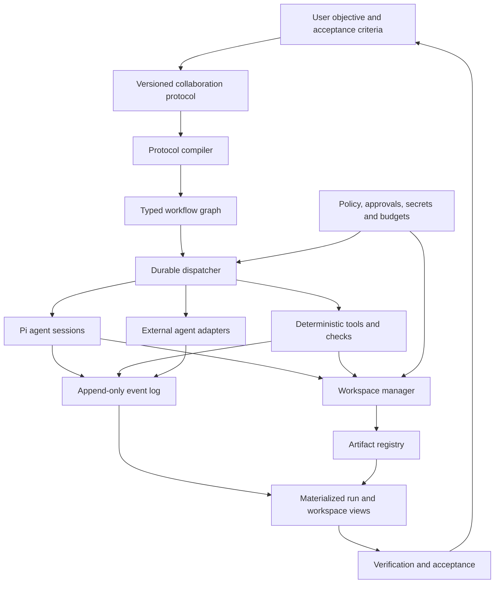

# Radian: complete agent systems landscape and improvement plan

**Research cut-off:** 13 September 2026  
**Scope:** delegation, collaboration modes, orchestration, organizational structures, harness capabilities, coding-agent products, agent frameworks, protocols, memory, evaluation, safety, durability, and experimental patterns.  
**Evidence:** current primary vendor documentation, first-party repositories, original papers, and inspection of this Radian checkout and its persisted harness configuration.

## Why this document exists

The earlier plans selected a few high-value modes too early. This document starts with the broad landscape and keeps the recommendation separate. It includes mature, emerging, experimental, and classical approaches so ideas such as advisors, decision committees, Fusion, swarms, blackboards, dynamic organizations, and agent auctions do not disappear merely because they are not first-release priorities.

“Complete” here means every materially distinct feature family and organization pattern found in the current survey. It does not mean every GitHub repository, vendor synonym, or minor setting. The underlying [Pi+ catalogue](../research/pi-plus-feature-catalogue.md) contains 454 source-specific feature records; this plan groups those records into a product and architecture map that can be acted on.

There is no universal state-of-the-art topology. Current evidence says the best organization depends on task shape:

- A single agent with strong tools and external verification is usually best for sequential, shared-state work.
- Independent parallel agents help when work truly decomposes or when diverse candidates are useful.
- A central coordinator limits error amplification better than uncontrolled peer coordination.
- Committees, debate, and fusion can improve selected decisions, but they add judge bias, correlated errors, latency, and cost.
- Durability, isolation, explicit contracts, evidence, and acceptance checks matter more than adding agent characters.

The target for Radian is therefore a **durable collaboration workbench**: one execution kernel, many explicit collaboration policies, inspectable artifacts, and measured promotion of useful modes.

## The complete map

Agent systems have seven separate layers. Product discussions become confused when these layers are all called “multi-agent.”

| Layer               | Question it answers                         | Examples                                                                           |
| ------------------- | ------------------------------------------- | ---------------------------------------------------------------------------------- |
| Harness             | What surrounds every model call?            | Sessions, prompts, tools, skills, permissions, compaction, workspaces, cost limits |
| Agent profile       | Who is this participant and what may it do? | Explorer, implementer, advisor, chair, reviewer, Luna sidekick                     |
| Collaboration mode  | How do participants relate for this task?   | Advisor, committee, lead-sidekick, debate, fusion, swarm                           |
| Orchestration graph | What runs when, with which dependencies?    | Pipeline, router, loop, fan-out/join, DAG, event-driven state machine              |
| Organization        | Where does authority and shared state live? | Manager hierarchy, flat team, blackboard, market, federation                       |
| Runtime             | How does work survive reality?              | Event log, retries, leases, checkpoints, sandboxes, worktrees, approvals           |
| Evaluation          | What establishes that the result is useful? | Tests, citation checks, rubrics, judges, human acceptance, recovery drills         |

Radian should model these as separate objects. A Research harness can run an Advisor, Committee, or Research Team. A Coding harness can run Solo + Verifier, Lead + Partner, Diagnostic Team, or Candidate Tournament. Changing the collaboration mode should not require creating another harness.

## 1. Complete collaboration-mode catalogue

The modes below are composable. The **maturity** column describes the pattern's public status, not a guarantee that it improves Radian tasks.

| Mode                             | Control and output                                                              | Best fit                                  | Main risk                                           | Maturity                     | Radian disposition                   |
| -------------------------------- | ------------------------------------------------------------------------------- | ----------------------------------------- | --------------------------------------------------- | ---------------------------- | ------------------------------------ |
| Single agent + skills            | One agent loads specialist instructions/tools on demand                         | Most sequential work                      | Missed perspective or self-review bias              | Mature                       | Default                              |
| Single agent + verifier          | One owner produces; a separate agent or deterministic gate verifies             | Coding, analysis, deliverables            | Weak verifier or proxy metric                       | Mature pattern               | Build first                          |
| Manager → subagents              | Lead invokes specialists as bounded tools and synthesizes                       | Broad tasks with separable questions      | Manager bottleneck and lossy summaries              | Mature                       | Already partial; harden              |
| Context-isolated subagent        | Child receives its own prompt, tools, permissions, and context                  | Focused research or code exploration      | Important context omitted in handoff                | Mature                       | Already partial; add manifests       |
| Router                           | Classifier chooses one specialist/path                                          | Requests with clear domains               | Misrouting and hidden policy                        | Mature                       | Add transparent routing              |
| Handoff                          | Control and responsibility transfer to a specialist                             | Genuine ownership change                  | Loops and loss of global context                    | Mature/emerging              | Add after durable continuation       |
| Sequential pipeline              | Fixed A → B → C artifact flow                                                   | Stable repeatable processes               | Early errors cascade                                | Mature                       | Already present                      |
| Planner → executor               | Planner creates tasks/spec; executor performs them                              | Large but structured implementation       | Bad plans constrain discovery                       | Mature pattern               | Add as preset                        |
| Lead → sidekick                  | Strong lead plans/reviews; persistent cheaper partner implements                | Cost-efficient execution                  | Brief quality and review overhead                   | Shipped/emerging             | Build early as Fusion Partner        |
| Reviewer / critic                | Independent agent finds faults against a rubric                                 | Plans, code, research                     | Fluent but superficial critique                     | Mature pattern               | Build first                          |
| Evaluator → optimizer loop       | Generate, evaluate, revise until gate/cap                                       | Testable artifacts                        | Endless proxy optimization                          | Mature pattern               | Build with fixed limits              |
| Advisor                          | One read-only second opinion returns evidence and objections                    | Architecture and decisions                | Anchoring or duplicated errors                      | Mature pattern               | Build first                          |
| Advisor panel / opinion ensemble | Several blind independent opinions remain side by side                          | Uncertain or taste-sensitive choices      | No resolution and high output volume                | Documented/emerging          | Build on candidate machinery         |
| Committee / council              | Members assess criteria; chair decides and preserves dissent                    | Consequential choices                     | Majority/chair bias and false consensus             | Research/emerging            | Build bounded version                |
| Red team / challenger            | One role seeks failure modes, attacks assumptions, or creates adversarial cases | Security, plans, experiments              | Unproductive pessimism                              | Mature pattern               | Advisor preset                       |
| Debate / cross-examination       | Agents exchange labelled rebuttals for fixed rounds                             | Surfacing hidden disagreement             | Rhetoric, conformity, quadratic context             | Mixed research               | Advanced opt-in                      |
| Best-of-N                        | Generate candidates; evaluator selects one                                      | Tasks with reliable scoring               | Selection optimizes a weak judge                    | Research/common              | Add after eval framework             |
| Tournament                       | Pairwise or staged elimination of candidates                                    | Many candidates and bounded judges        | Order/bracket bias                                  | Experimental product pattern | Later                                |
| Compare proposals                | Keep candidates separate for user choice                                        | Subjective design decisions               | Decision burden remains with user                   | Simple/mature                | Build first                          |
| Fusion / synthesis               | Aggregator combines complementary parts and records provenance                  | Documents, plans, compatible designs      | Invented consensus and unsafe merges                | Research/emerging            | Build first for read-only artifacts  |
| Mixture of Agents                | Layered proposers feed one or more aggregator layers                            | Text generation with diversity            | Large token/latency multiplication                  | Research                     | Evaluation experiment                |
| Parallel specialist fan-out      | Different workers answer independent subquestions                               | Research, tests, static analysis          | Correlated errors and rate limits                   | Mature                       | Already partial; harden joins        |
| Map-reduce                       | Many mapped outputs feed one reducer                                            | Large corpora or repeated analysis        | Reducer loses detail or overflows context           | Mature                       | Add typed reducer                    |
| Explicit DAG team                | Dependencies govern ready work and joins                                        | Known multi-step projects                 | Incorrect edges and partial failure                 | Mature/emerging              | Already present                      |
| Diagnostic team                  | Workers test distinct hypotheses; lead chooses next probe                       | Hard bugs and regressions                 | Duplicated investigation or unsafe concurrent edits | Product pattern              | Early preset                         |
| Research team                    | Scouts split sources/questions; deduplicate; synthesize and cite                | Literature and market research            | Source duplication and citation drift               | Mature pattern               | Repair existing preset               |
| Hierarchical team                | Lead delegates to managers or teams                                             | Cross-project or very large tasks         | Authority, cost, and context multiply               | Emerging                     | Keep depth capped                    |
| Dynamic role creation            | Orchestrator creates roles/nodes while running                                  | Open-ended tasks                          | Role explosion and irreproducibility                | Experimental/emerging        | Later, schema- and budget-capped     |
| Flat peer team                   | Peers share tasks and message each other                                        | Cooperative exploration                   | Ambiguous ownership and chat bloat                  | Experimental product feature | Optional, not default                |
| Swarm                            | Peers select or hand off to the next actor dynamically                          | Open-ended exploration                    | Loops, nondeterminism, context bloat                | Experimental                 | Research only initially              |
| Blackboard                       | Agents publish typed facts, hypotheses, and artifacts to shared state           | Long investigations and mixed specialists | Stale/untrusted writes and unbounded board          | Classical, newly relevant    | Build artifact board before autonomy |
| Shared task list                 | Agents claim and complete tasks visible to the team                             | Parallel implementation/research          | Double claiming and stale leases                    | Shipped/emerging             | Add through dispatcher               |
| Isolated worktree contributors   | Each worker changes its own checkout; integrator merges                         | Parallel code candidates                  | Merge conflicts and integration regressions         | Mature engineering technique | Build                                |
| Contract Net / auction           | Workers bid cost, time, confidence, and capabilities; allocator awards          | Heterogeneous local/remote worker pool    | Gaming and large allocation overhead                | Classical/research           | Simulation later                     |
| Reputation-based market          | Historical performance influences bids and routing                              | Large recurring agent economy             | Metric gaming and cold start                        | Experimental research        | Defer                                |
| Human-in-the-loop                | System pauses for choice, approval, correction, or missing input                | External effects and preference decisions | Lost pause state and approval fatigue               | Mature                       | Make durable                         |
| Cross-agent federation           | Independent services exchange task, status, messages, and artifacts             | Remote agents and other products          | Trust, auth, retries, capability drift              | Emerging protocol            | Boundary adapter only                |

### Useful named combinations

Radian should ship understandable combinations rather than asking users to draw every graph:

| Product mode         | Composition                                                       | User receives                                 |
| -------------------- | ----------------------------------------------------------------- | --------------------------------------------- |
| Solo                 | Single agent + tools + acceptance checks                          | One direct result                             |
| Verify               | Solo → independent reviewer or deterministic checks               | Result plus verification state                |
| Ask Advisor          | Blind or targeted read-only advisor                               | Recommendation, objection, uncertainty        |
| Compare              | Two to five independent candidates                                | Side-by-side alternatives                     |
| Decision Committee   | Blind assessments → one objection round → chair                   | Decision record and minority view             |
| Challenge            | Proposal → red-team review                                        | Failure modes and discriminating checks       |
| Fuse                 | Independent candidates → critic → provenance-preserving synthesis | One new artifact plus lineage                 |
| Fusion Partner       | Lead brief → persistent Luna sidekick → lead review/correction    | Accepted implementation or explicit handback  |
| Validate and Repair  | Builder → checks → bounded repair loop                            | Final artifact validated at exact revision    |
| Diagnostic Team      | Hypotheses → parallel investigation → lead next-step selection    | Root-cause packet and evidence                |
| Research Team        | Parallel retrieval → deduplication → synthesis → citation gate    | Cited report and source ledger                |
| Plan and Execute     | Planner → dependency graph → workers → integrator                 | Executed plan and artifact set                |
| Candidate Tournament | Isolated implementations → common evaluation → selection          | Winner, scores, and retained alternatives     |
| Debate               | Blind proposals → bounded rebuttal → decision/user                | Arguments, revisions, unresolved disagreement |
| Blackboard Lab       | Specialists update typed shared evidence; controller schedules    | Living evidence board and conclusion          |
| Adaptive Team        | Router creates/selects roles under hard caps                      | Dynamic run trace and deliverable             |
| Federated Task       | Remote agent card → task → streamed artifacts/status              | External result with local audit record       |

## 2. Orchestration and control-flow catalogue

Collaboration roles sit on top of reusable execution primitives. Radian should support these primitives once and compile product modes into them.

| Primitive               | Meaning                                       | Required runtime behavior                             | Radian today                           |
| ----------------------- | --------------------------------------------- | ----------------------------------------------------- | -------------------------------------- |
| Direct call             | One step, one result                          | Typed input/output, timeout, cancellation             | Present                                |
| Prompt chain            | Fixed ordered transformations                 | Artifact passing and step provenance                  | Present through workflows              |
| Conditional router      | Choose edge from state/result                 | Deterministic route record and fallback               | Partial                                |
| Parallel sectioning     | Different subtasks run concurrently           | Admission control and partial-failure policy          | Present                                |
| Parallel voting         | Same task runs independently                  | Frozen brief, randomized candidate order, judge       | Partial building blocks                |
| Fan-out/fan-in          | Spawn N and join all/some                     | Join policy, missing-child semantics, retry one child | Partial                                |
| Map-reduce              | Map arbitrary items, aggregate                | Bounded concurrency and reducer schema                | Missing generic primitive              |
| DAG                     | Run nodes when dependencies clear             | Cycle validation, ready queue, join states            | Present                                |
| Loop                    | Repeat while a condition holds                | Attempt IDs, fixed caps, stable evaluator             | Missing as first-class graph construct |
| Generator-evaluator     | Candidate plus critique/score                 | Separate artifacts and evaluator version              | Missing preset                         |
| Planner-generated graph | Model proposes a graph before execution       | Schema validation, preview, approval, graph version   | Missing                                |
| Dynamic graph           | Add nodes/edges during execution              | Role/node caps and deterministic event history        | Missing                                |
| Interrupt               | Pause at a durable boundary                   | Persisted continuation and exact pending action       | Partial                                |
| Human approval          | Await explicit authorization                  | Input digest, scope, expiry, resume after restart     | Partial                                |
| Event-driven workflow   | External or internal event triggers next step | Durable event cursor and idempotency                  | Missing general form                   |
| Schedule / heartbeat    | Time triggers a run or check                  | Timezone, recurrence, quiet policy, run history       | Missing harness-wide                   |
| Durable timer           | Wait without a live process                   | Persisted wake time and cancellation                  | Missing                                |
| Retry                   | Re-attempt a failed logical action            | Stable action ID, unique attempt ID, backoff          | Partial                                |
| Compensating action     | Reconcile or undo an external side effect     | Operation ledger and adapter-specific semantics       | Missing general contract               |
| Nested workflow         | A node invokes another versioned graph        | Budget inheritance, depth cap, parent trace           | Partial via labs, not unified          |
| Wait-any / quorum       | Continue after first useful result or K of N  | Cursor, cancellation/retention of remaining work      | Missing                                |
| Streaming join          | Consume partial child artifacts               | Versioned incremental result schema                   | Missing                                |
| Replay / time travel    | Reconstruct or fork prior state               | Append-only events and compatible workflow version    | Partial session branching only         |

## 3. Organization and authority catalogue

The same graph behaves differently depending on who owns planning, writes, acceptance, and shared memory.

| Organization                | Authority model                                                         | Shared state                           | Appropriate use in Radian                  |
| --------------------------- | ----------------------------------------------------------------------- | -------------------------------------- | ------------------------------------------ |
| Tool-using individual       | One agent owns plan and result                                          | Its session and workspace              | Default task                               |
| Manager with tools          | Lead remains accountable; agents behave as tools                        | Parent ledger and child artifacts      | Normal delegation                          |
| Dispatcher + specialists    | Server routes typed assignments; no autonomous manager needed           | Durable task queue                     | Reliable preset execution                  |
| Lead + partner              | Lead owns interpretation and acceptance; partner owns bounded execution | Briefs, feedback, partner session      | Fusion Partner                             |
| Functional team             | Stable roles such as scout, coder, tester                               | Workflow state                         | Research/Coding presets                    |
| Project team                | Roles own modules or workstreams                                        | Shared board plus isolated workspaces  | Multi-file projects                        |
| Hierarchy                   | Delegation may nest through managers                                    | Ledgers at every level                 | Cross-project work with depth cap          |
| Flat team                   | Peers claim tasks and communicate                                       | Shared task list/chat                  | Optional experimental UX                   |
| Blackboard organization     | Controller schedules knowledge sources based on board state             | Typed, versioned evidence board        | Long investigation and curator             |
| Swarm                       | Peers locally choose next actor                                         | Shared conversation/state              | Experimental exploration                   |
| Market                      | Allocator awards contracts from bids                                    | Contract and reputation ledger         | Future heterogeneous fleet                 |
| Federation                  | Each remote agent remains independently operated                        | Protocol tasks/artifacts, local mirror | External A2A/ACP adapter                   |
| Human-governed organization | User retains selected decisions and approvals                           | Decision/approval ledger               | Consequential choices and external effects |

Four authority roles must remain explicit in every run:

1. **Planner:** may propose tasks and dependencies.
2. **Scheduler:** decides what is admitted and when it executes.
3. **Writer:** may modify a particular workspace or external system.
4. **Acceptor:** decides whether the produced artifact satisfies the task.

An LLM can fill any of these roles when policy permits, but it must not silently acquire the others. A committee chair is an acceptor recommendation, not authorization for an external side effect.

## 4. Complete harness capability inventory

This table covers the feature surface found across Pi, Codex, Claude Code/Agent SDK, Gemini CLI, GitHub Copilot, Cursor, Devin, OpenHands, OpenCode, and adjacent harnesses.

| Capability family         | Concrete capabilities in the landscape                                                                                      | Radian state                                                        | Plan                                                                           |
| ------------------------- | --------------------------------------------------------------------------------------------------------------------------- | ------------------------------------------------------------------- | ------------------------------------------------------------------------------ |
| Harness profiles          | Named setups; versioned prompt/model/tools/skills/permissions/workspace/eval bundles; project overrides; per-run overrides  | Harnesses and snapshots exist; no complete versioned profile object | Unify into `ProfileVersion`                                                    |
| Agent identities          | Role prompt, display identity, model, reasoning, tools, skills, limits, delegation ability                                  | Strong foundations and 13 Science specialists                       | Keep roles; add capability preflight and usefulness telemetry                  |
| Model registry            | Provider/model metadata, context/output limits, tool/image support, reasoning controls, cache behavior, prices              | Pi metadata and overrides available                                 | Show requested/effective model and live capability facts                       |
| Model routing             | Static slot choice, rule router, escalation, fallback, cost/latency/quality policy                                          | Manual override; no transparent router                              | Add explicit rules and record every route                                      |
| Instruction hierarchy     | Global, project, directory, harness, agent, run instructions with precedence and provenance                                 | Multiple instruction sources exist                                  | Add manifest, precedence explanation, hashes                                   |
| Skills and commands       | On-demand skills, prompts, slash commands, reusable capability packs                                                        | Pi skills and Radian resources exist                                | Version/trust skills; lazy-load; inspect activation                            |
| Context assembly          | Just-in-time retrieval, selected file ranges, repository maps, tool-output offloading, token budgets                        | Resource loading and estimates exist                                | Full context manifest and budget                                               |
| Compaction                | Automatic/manual compaction, structured summaries, branch summaries, custom hooks                                           | Pi compaction present                                               | Persist cut point, retained IDs, summary provenance and failures in Radian run |
| Session lifecycle         | New/resume/fork/clone/tree, naming, archive, branch, rewind, export                                                         | Pi session strengths exposed partly                                 | Unify task runs and worker sessions; distinguish retry/continue/fork           |
| Steering                  | Immediate steering, queued follow-up, interrupt, pause, answer child, redirect, wait-any                                    | Parent controls and background status/cancel exist                  | Add persisted typed messages and cursor waits                                  |
| Memory                    | Working notes, user/project facts, editable blocks, extraction, consolidation, temporal/provenance-aware memory, forgetting | Curator and scientific ledger exist                                 | Distinguish instructions, approved facts, summaries, and transient retrieval   |
| Retrieval                 | Keyword/vector/hybrid, metadata filters, reranking, graph/entity retrieval, doc indexing                                    | Research tools exist but workflow filtering can remove them         | Effect-aware tools, provenance, query/result trace                             |
| Built-in tools            | Read/search/edit/patch/shell/git/browser/computer use/documents/images/data tools                                           | Pi and extensions provide broad surface                             | Namespaced capabilities with effect/risk metadata                              |
| MCP                       | Local/remote transports, OAuth, prompts/resources/tools, lazy schema discovery, server policies                             | Extension/config dependent                                          | Registry, auth references, health, per-tool policy, cancellation               |
| Agent protocols           | A2A cards/tasks/artifacts/streaming/push; ACP/editor agents; Agent Protocol task/step API                                   | Absent                                                              | Use only for external agent boundaries                                         |
| Tool policy               | Allow/ask/deny, wildcard/resource/path/command rules, precedence and reason                                                 | Partial and path-specific mechanisms                                | Central policy engine and decision explanation                                 |
| Sandbox                   | Filesystem/network/process containment, containers/VMs, mount policies                                                      | Shared local process; leases are coordination only                  | Worktree first, then optional container/remote adapter                         |
| Secrets                   | OS vault/keychain references, per-run injection, scopes, redaction, rotation/audit                                          | Tool credentials exist; isolation not comprehensive                 | Never store raw secret in profile; expose why it is available                  |
| Project trust             | Gate local skills/extensions/instructions and show provenance                                                               | Pi trust model available                                            | Surface and persist trust decision                                             |
| Workspace lifecycle       | Current checkout, worktree, container/cloud environment; base ref, ports, processes, cache, teardown                        | Workflow writer lease; new workspace layer in checkout              | Make workspace a first-class run resource                                      |
| Shared-write coordination | Single writer token, ownership, isolated branches, explicit integration                                                     | Process-wide workflow lease only                                    | One Radian-wide lease plus worktree integration                                |
| Background work           | Queue, start, progress, follow-up, takeover, cancel, archive                                                                | Background subagents exist in memory/process scope                  | Persist scheduler and continuation across restart                              |
| Schedules                 | One-shot/recurring/event-triggered runs, notification policy, run history                                                   | No common harness scheduler                                         | Add after durable run kernel                                                   |
| Graph/workflow editor     | Typed nodes/edges, validation, templates, nested graphs, loops, dynamic nodes                                               | DAG editor/runtime exists                                           | Keep; add compilation from collaboration protocols                             |
| Artifacts                 | Diffs, files, logs, structured results, citations, screenshots/video, patches, branches                                     | Receipts/transcripts and UI exist                                   | Unified artifact registry with hashes and lineage                              |
| Checkpoints and undo      | Conversation rewind, filesystem snapshot/patch, external-effect limits                                                      | Pi branches and receipts; no unified rollback                       | Separate transcript, workspace, and external-effect recovery                   |
| Event observability       | Append-only events, parent/child trace, tool spans, model requests, approvals, compaction, replay/export                    | Receipts, summaries, revisions, polling                             | Build event log and materialized views                                         |
| Usage and budgets         | Tokens, costs, tool time, concurrency, max turns/steps, reservations, provider quotas                                       | Stronger for workflows than ad hoc work                             | One inherited budget tree for every run                                        |
| Failure handling          | Timeouts, backoff, retry classification, substitute model, partial joins, doom-loop detection                               | Several workflow states and conservative external retry             | Generalize lifecycle and recovery reasons                                      |
| Acceptance                | Tests, lint, schema, citation coverage, browser/visual evidence, human review                                               | Structural workflow output checks only                              | Separate execution from acceptance state                                       |
| Evaluation                | Fixtures, repeated probabilistic trials, benchmark runners, prompt/profile comparisons, red-team cases                      | No full behavioral harness                                          | Add deterministic and repeated behavioral suites                               |
| Curator / learning        | Reviewable memory or prompt patches, incident lessons, held-out evaluation, rollback                                        | Curator proposal mechanism exists                                   | Tie proposals only to accepted outcomes and evals                              |
| Collaboration UX          | Run graph, child status, task board, proposals, dissent, budget, artifacts, approval attention                              | Strong emerging graph/workspace UI                                  | Make one run model feed every view                                             |
| Extensibility             | Hooks, middleware, provider adapters, extensions, plugins, hot reload, SDK/RPC/headless mode                                | Strong Pi/Radian architecture                                       | Add version/trust/compatibility boundaries                                     |

## 5. Coding-agent and harness landscape

This is a capability comparison, not a winner ranking. Public documentation differs in detail and several cloud features depend on account, plan, or deployment.

| Product/system                           | Distinctive current strengths to study                                                                                                               | Main public gap or caveat                                                                     | Radian lesson                                                                 |
| ---------------------------------------- | ---------------------------------------------------------------------------------------------------------------------------------------------------- | --------------------------------------------------------------------------------------------- | ----------------------------------------------------------------------------- |
| Pi SDK / coding agent                    | JSONL session trees; branching; compaction; skills; TypeScript extensions; model/provider metadata; RPC                                              | No central sandbox, scheduler, behavioral evals, or durable multi-agent kernel in core        | Keep Pi as execution engine; build Radian layer around it                     |
| OpenAI Codex + Agents SDK                | Hierarchical instructions; skills; subagents; sandbox/approval separation; worktrees; traces; manager vs handoff                                     | UI/API surfaces differ; cost traces are not always final billing                              | Copy explicit agent resources, traces, isolation, and orchestration semantics |
| Claude Code / Agent SDK / Managed Agents | Isolated subagents; experimental teams; hooks; checkpoints; managed versioned agents; event sessions; vaults                                         | Several managed/team APIs are beta; checkpoint does not undo every shell/external change      | Copy resource versioning, durable interrupt, hook/policy clarity              |
| Gemini CLI                               | Hierarchical memory; subagents and remote A2A agents; plan mode; policy engine; many sandbox backends; behavioral evals; worktrees                   | Many features are experimental and quotas vary                                                | Best reference for policy plus repeated behavioral testing                    |
| GitHub Copilot coding agent / CLI / SDK  | Custom agent profiles; GitHub issue-to-PR flow; ephemeral Actions environment; MCP; lifecycle events                                                 | Public compaction/recovery semantics are incomplete                                           | Study repository-native cloud delegation and PR artifact flow                 |
| Cursor                                   | Background/cloud agents; worktrees; run modes; separate permission/sandbox files; automations; takeover; visual proof artifacts                      | Context/eval internals are less public; cloud execution has material secret/network risk      | Study environment lifecycle, follow-up, automation, proof UI                  |
| Devin                                    | Persistent operational sessions; playbooks; knowledge; ACU caps; scheduled runs; secrets scopes; snapshots; event/issue timeline; testing recordings | Model routing and compaction internals are not public; performance claims are vendor-specific | Study schedules, playbooks, session operations, evidence artifacts            |
| OpenHands                                | Agent/LLM/conversation/workspace separation; Docker/remote sandbox; headless JSONL; ACP; eval harness; experimental critic                           | Process sandbox is unsafe; deployment behaviors vary                                          | Study workspace abstraction, event stream, benchmark integration              |
| OpenCode                                 | Inspectable session server API; agents; skills; MCP; permissions; fork/revert/summarize; 75+ providers                                               | Cloud isolation/evals depend on deployment and v2 is fast-moving                              | Study local API surface and permission granularity                            |
| Aider                                    | Repository map; architect/editor model separation; precise diff/edit workflows                                                                       | Narrower harness and team model                                                               | Keep planning separate from code-edit translation when useful                 |
| Cline                                    | Human approvals, browser/computer interactions, MCP, checkpoints and provider choice                                                                 | Extension/product behavior varies by version                                                  | Study approval-rich local workflow and browser evidence                       |
| Roo Code                                 | Custom modes, orchestrator roles, room for tool-specific permissions and workflows                                                                   | Broad configuration can become inconsistent                                                   | Study user-defined modes while keeping one typed kernel                       |
| Goose                                    | Local extensible agent with MCP/recipes and provider flexibility                                                                                     | Less complete organization/durability surface                                                 | Study recipes and lightweight extensibility                                   |
| Continue                                 | IDE-integrated models, rules, prompts, context providers and checks                                                                                  | Primarily IDE assistant rather than durable team runtime                                      | Study context providers and developer workflow integration                    |
| SWE-agent                                | Agent-computer interface and executable software-engineering evaluation                                                                              | Research/evaluation system, not a general desktop workbench                                   | Treat tool interface and executable acceptance as first-class                 |
| Fusion Harness                           | Pi-based Opinion, Fusion, Debate, collaboration DAG, validation, and single-writer policy                                                            | OSS claims; no independent outcome benchmark; launch persistence limitations                  | Direct reference for modes, but implement against Radian’s durable kernel     |
| pi-fusion                                | Pi lead/sidekick with persistent task context and follow-up                                                                                          | Small community package without broad evaluation                                              | Direct vertical-slice reference for Fusion Partner                            |
| Devin Fusion                             | Frontier lead plus cheaper persistent sidekick; brief/result/feedback protocol                                                                       | Vendor/pairing-specific measurements; some task results vary                                  | Keep lead-sidekick separate from committee and N-way fusion                   |

The detailed source-specific coding harness records remain in [coding-harnesses.md](../research/coding-harnesses.md) and the [Pi+ catalogue](../research/pi-plus-feature-catalogue.md).

## 6. Framework, protocol, and research-system landscape

| System                              | What it contributes                                                                       | Status                                         | Radian use                                                            |
| ----------------------------------- | ----------------------------------------------------------------------------------------- | ---------------------------------------------- | --------------------------------------------------------------------- |
| LangGraph                           | State graphs, checkpoints, thread IDs, pending writes, interrupts, subgraphs, replay      | Production-oriented framework                  | Reference for durable state and interrupts                            |
| Microsoft Agent Framework / AutoGen | Round robin, selector, Swarm, GraphFlow, checkpoints, teams                               | Mature/emerging; some graph/team APIs evolving | Reference for topology choices and state save/load                    |
| Magentic-One                        | Central orchestrator, Task Ledger, Progress Ledger, specialists, replanning               | Research system plus framework implementation  | Copy ledgers and stalled-progress reasoning                           |
| CrewAI                              | Role-based Crews inside persistent event-driven Flows                                     | Production-oriented framework                  | Separate team definition from lifecycle flow                          |
| Google ADK                          | Sequential/parallel/loop templates, typed graphs, joins, dynamic/resumable workflows, A2A | Fast-moving production SDK                     | Reference for graph validation and typed joins                        |
| OpenAI Agents SDK                   | Agents, tools, handoffs, guardrails, sessions, traces                                     | Production SDK                                 | Copy manager/handoff distinction and trace hierarchy                  |
| Anthropic agent patterns            | Prompt chain, route, parallelize, orchestrator-workers, evaluator-optimizer               | Practitioner guidance                          | Use as task-shape dispatch taxonomy                                   |
| Temporal                            | Event-sourced workflows, deterministic replay, durable timers, retries, activities        | Mature workflow platform                       | Reference for semantics; likely too heavy as initial dependency       |
| Mastra                              | TypeScript agents, workflows, memory, observability and eval-oriented tooling             | Production-oriented ecosystem                  | Study TypeScript developer experience, avoid parallel state authority |
| n8n                                 | Visual event automation, integrations, human steps and AI nodes                           | Mature automation platform                     | External workflow integration, not internal coding-agent kernel       |
| LlamaIndex Workflows                | Typed event workflows plus retrieval/data framework                                       | Production-oriented library                    | Reference for retrieval-orchestration bridge                          |
| DSPy                                | Typed signatures, modules, metric-driven prompt/program optimization                      | Research-to-production library                 | Later profile optimization under held-out evals                       |
| Letta / MemGPT                      | Explicit working memory and editable blocks                                               | Production/research lineage                    | Reference for memory types and user inspection                        |
| Mem0                                | Extracted long-term memories and graph options                                            | Production-oriented service/library            | Optional memory backend, never invisible authority                    |
| Zep / Graphiti                      | Temporal entity/relationship graph and provenance-aware facts                             | Production-oriented graph memory               | Later knowledge graph adapter                                         |
| MCP                                 | Host/client/server tools, resources, prompts, capability negotiation                      | Widely adopted evolving protocol               | Tool/context boundary                                                 |
| A2A                                 | Agent cards, stateful tasks, messages, artifacts, streaming/push                          | Emerging protocol                              | Remote agent boundary only                                            |
| ACP                                 | Editor/client-to-agent process protocol                                                   | Emerging protocol                              | Adapter for external coding agents                                    |
| Agent Protocol                      | Minimal REST task/step/artifact interface                                                 | Early protocol                                 | Benchmark/service compatibility only                                  |
| OpenHands SDK                       | Agent, LLM, conversation, workspace, events and sandbox abstractions                      | Production/research                            | External agent adapter and workspace reference                        |
| MetaGPT                             | Software-company roles and SOP/assembly-line artifacts                                    | Research prototype                             | Workflow template ideas, not runtime foundation                       |
| ChatDev                             | Staged design/coding/testing role dialogues                                               | Research prototype                             | Phase visualization and artifact handoffs                             |
| CAMEL                               | Role-playing cooperation and inception prompting                                          | Research prototype                             | Role-prompt study only                                                |
| OpenAI Swarm                        | Lightweight routines and handoffs                                                         | Experimental reference                         | Semantics reference, not durability layer                             |
| Deep Agents                         | Isolated subagents, pluggable filesystems, tool-output offloading, skills, middleware     | Composable library                             | Reference for context and filesystem seams                            |
| Langfuse                            | Nested traces, prompt versions, datasets, judges, annotations, alerts, OpenTelemetry      | Mature observability platform                  | Optional export; Radian event log remains source of truth             |
| Promptfoo                           | Deterministic assertions, datasets, adversarial generation, red-team reports              | Mature evaluation tool                         | Optional profile and security eval runner                             |

## 7. Experimental and classical ideas worth retaining

These ideas belong in the landscape even though Radian should not enable all of them immediately.

| Idea                        | Mechanism                                                                          | Potential value                                   | Required guardrail                                           |
| --------------------------- | ---------------------------------------------------------------------------------- | ------------------------------------------------- | ------------------------------------------------------------ |
| Self-consistency            | Sample independent reasoning paths and select consistent output                    | Diversity without persistent team complexity      | Strong task-specific selector                                |
| LLM-Blender                 | Pairwise rank candidates, then generatively fuse                                   | Separates selection from synthesis                | Preserve candidates and evaluate fused artifact              |
| Multi-agent debate          | Rebuttal rounds and final common/chair answer                                      | Exposes conflicts on hard questions               | Blind first round, max rounds, dissent, external check       |
| Mixture of Agents           | Layers of proposers and aggregators                                                | Can improve selected text benchmarks              | Top-k pruning and strict cost/context cap                    |
| Reflexion                   | Store critique between attempts                                                    | Learn from concrete failure within a task         | Fixed attempts and stable acceptance criteria                |
| ACE                         | Generator, reflector, curator update a bounded playbook                            | Reviewable harness learning                       | Patch provenance, held-out eval, approval, rollback          |
| Recursive Language Models   | Keep large context outside prompt; inspect/decompose with code and recursive calls | Work over very large inputs                       | Sandbox, recursion/spend caps, trajectory log                |
| Code execution with MCP     | Discover tools lazily and process results in code outside model context            | Lower context use and richer compositions         | Namespaced tools, secret handles, sandbox, audit             |
| Autoresearch loop           | Agent edits bounded surface; runs fixed-budget experiment; keeps improvements      | Measurable autonomous optimization                | Immutable evaluator and experiment ledger                    |
| Ralph-style loop            | Fresh contexts use files/Git/requirements to continue one story at a time          | Long-running progress without huge chat           | Stale-work recovery and objective acceptance                 |
| Blackboard                  | Typed shared evidence plus controller                                              | Opportunistic collaboration and inspectable state | Versioned entries, trust/provenance, bounded board           |
| Contract Net                | Task announcement, bids, award, report                                             | Capability/cost-aware allocation                  | Contracts, private estimates, hard budgets, audit            |
| Reputation market           | Historical outcome scores influence routing                                        | Adaptive allocation at fleet scale                | Gaming-resistant metrics and exploration policy              |
| Dynamic organizations       | Create roles/teams/edges during a run                                              | Flexibility on unknown tasks                      | Preview, caps, schema validation, reproducible event history |
| Agent-written skills        | Successful procedures become reusable skills                                       | Faster repeated work                              | Review, permission diff, tests, signing/versioning           |
| Prompt/program optimization | Search prompts/demonstrations/program choices against metrics                      | Evidence-based profile improvement                | Train/validation separation and rollback                     |

## 8. What Radian already has

The live checkout is substantially beyond a simple chat wrapper.

| Area                   | Observed implementation                                                                                              | Assessment                                  |
| ---------------------- | -------------------------------------------------------------------------------------------------------------------- | ------------------------------------------- |
| Delegation             | One task, sequential chains, synchronous parallel batches, background start/status/wait/cancel                       | Strong base                                 |
| Hierarchy              | Harness head delegates to registered labs; specialists cannot recursively delegate                                   | Good bounded authority                      |
| Agent profiles         | Prompts, tools, skills, models, reasoning, project/harness instructions, chat snapshots                              | Strong but fragmented                       |
| Workflow graph         | Acyclic dependencies, `reads`, `dependsOn`, shared validated output, parallel capacity one to six                    | Strong base                                 |
| Partial failure        | Failed branches block dependents; independent branches can finish; manual resume retains completed steps             | Good semantics                              |
| Budgets                | Turn/time limits; workflow and step cost limits with reservations                                                    | Uneven outside workflows                    |
| Persistence            | Atomic receipts, summaries, public transcripts, parent IDs, PID interruption detection                               | Evidence persistence, not full continuation |
| Workspace coordination | Canonical-path process-wide reader/writer lease for workflow steps                                                   | Useful but incomplete boundary              |
| Context and memory     | Pi compaction, resource loading, instruction versions, context receipts, curator proposals, scientific-memory ledger | Strong ingredients                          |
| UI                     | Delegation branches, workflow graph, worker details, shared workspace overview                                       | Strong emerging surface                     |

Two configured reality checks matter:

- The Coding harness currently has no saved specialists or workflows.
- Science Pi has 13 specialists, but its saved literature workflow is a sequential four-step chain with default single concurrency.

The runtime supports more than the active presets demonstrate. Radian should show the difference between **engine capability**, **configured capability**, and **capability proven by an accepted run**.

## 9. Complete Radian gap ledger

| Gap                                                    | Consequence                                                             | Required change                                           | Priority |
| ------------------------------------------------------ | ----------------------------------------------------------------------- | --------------------------------------------------------- | -------- |
| Research tools stripped by name-based read-only filter | Literature scout can lose the tools needed to retrieve literature       | Effect/capability metadata and preflight validation       | P0       |
| Coding has no useful default team/workflow             | The strongest engine path is invisible in normal use                    | Explorer/implementer/reviewer presets                     | P0       |
| Ad hoc and workflow runs use different lifecycle rules | Different failure, budget, write, and persistence behavior              | Shared task dispatcher and contracts                      | P0       |
| Receipts do not restore a dead worker session          | “Saved” work can be inspectable but not continuable                     | Durable worker sessions and recovery choices              | P0       |
| Writer lease covers only participating workflow work   | Ad hoc agent, other server, user, or shell can conflict                 | Radian-wide ownership plus isolated worktrees             | P0       |
| Completion equals a successful assistant finish        | Valid-looking output may not satisfy the task                           | Separate acceptance/verification state                    | P0       |
| External action retry is not end-to-end idempotency    | Unknown outcomes can duplicate side effects                             | Durable operation ledger and reconciliation               | P0       |
| Context estimate is incomplete                         | Overflows and invisible prompt changes are hard to explain              | Full run/context manifest                                 | P0       |
| Cost accounting is workflow-centric                    | Child/ad hoc cost can escape parent budget                              | Inherited budget tree                                     | P0       |
| Background capacity and promises are in memory         | Restart loses scheduler ownership                                       | Durable queue, lease heartbeat, recovery                  | P0       |
| No reusable worker follow-up identity                  | Advisor/partner cannot maintain a reliable dialogue                     | Persisted task address and typed messages                 | P1       |
| No wait-any/quorum cursor                              | Parent cannot efficiently consume first useful child                    | Durable event cursor and wait policy                      | P1       |
| Fixed DAG has no loop primitive                        | Validate-repair and iterative research need ad hoc control              | Bounded controller/loop nodes                             | P1       |
| No generic artifact registry                           | Diffs, citations, logs, screenshots and candidates are inconsistent     | Hash-addressed artifacts and lineage                      | P1       |
| No central policy engine                               | Tool names, paths, and roles can apply inconsistent controls            | Allow/ask/deny plus containment policy                    | P1       |
| Sandbox and authorization are not separately visible   | Approval may be mistaken for technical containment                      | Separate policy surfaces and explanations                 | P1       |
| Secrets are not isolated per run/profile               | Broad credentials increase impact and reduce auditability               | OS keychain references, scoped injection, redaction       | P1       |
| Worktree is not a full environment lifecycle           | Ports, processes, caches, network, and cleanup remain unmanaged         | Workspace adapters and lifecycle record                   | P1       |
| No collaboration protocol schema                       | Each new mode risks custom state and UI                                 | Versioned `CollaborationProtocol` compiled to graph       | P1       |
| No proposal/decision/dissent records                   | Committee and fusion become transcripts rather than auditable decisions | Typed proposal and decision objects                       | P1       |
| No behavioral evaluation suite                         | More agents can be shipped without evidence of benefit                  | Deterministic fixtures plus repeated probabilistic trials | P1       |
| Observability is receipt/poll based                    | Recovery and live multi-agent reasoning are hard to inspect             | Append-only event log and materialized views              | P1       |
| No harness-wide schedules/automations                  | Long-running monitoring needs external machinery                        | Durable triggers after run kernel                         | P2       |
| No external agent adapters                             | Cannot safely federate with A2A/ACP agents                              | Boundary adapters with local event mirror                 | P2       |
| Curator is not tied to accepted outcome/eval evidence  | Speculation can become durable instruction pressure                     | Accepted-run provenance and held-out gates                | P2       |
| No measured routing policy                             | Model/role escalation can become hidden and expensive                   | Transparent router with offline evaluation                | P2       |

The focused code-level findings and source map are in [radian-agent-orchestration-improvement-plan.md](./radian-agent-orchestration-improvement-plan.md). The precise Advisor, Committee, Fusion Partner, Fuse, and Validate/Repair protocols are in [radian-collaboration-modes-plan.md](./radian-collaboration-modes-plan.md).

## 10. Target Radian architecture



### Core domain objects

```text
ProfileVersion
  identity, prompt, model policy, tools, skills, permissions,
  sandbox/workspace policy, limits, verification recipe

CollaborationProtocol
  mode, participant slots, context-sharing rules, phase boundaries,
  output contracts, writer policy, join/failure policy, limits

Run
  runId, parentRunId, protocolVersion, profile hashes, workspace,
  status, authorization scope, budget tree, deadline

Step / Assignment
  taskId, logicalActionId, attemptId, objective, inputs, owner,
  capabilities, dependencies, acceptance criteria, retry policy

Proposal / Decision
  candidate, evidence, assumptions, risks, rubric, scores,
  dissent, selection, synthesis lineage, approval

Artifact
  type, content hash, producing attempt, workspace revision,
  source lineage, validation evidence

Event
  sequence, timestamp, actor, type, correlation IDs, payload,
  artifact references, policy/approval reference
```

Persist the event before exposing each state transition. Keep `logicalActionId` stable across retries and use a fresh `attemptId` for each invocation. A workflow resume must use the original compatible graph/profile versions or visibly fork to a new run.

### Required boundaries

1. Pi remains the model and tool execution engine.
2. Radian owns orchestration, persistence, policy, budgets, recovery, and UI state.
3. MCP supplies tools and context; it is not the internal team protocol.
4. A2A, ACP, and Agent Protocol represent external agents only.
5. One shared checkout has one Radian-managed writer at a time.
6. Parallel writers use isolated workspaces and a separate integration step.
7. Sandbox containment and user authorization remain separate decisions.
8. An agent's judgment can recommend acceptance; deterministic policy and the authorized acceptor decide it.

## 11. Implementation roadmap that preserves the full landscape

The roadmap builds primitives once, then exposes the catalogue progressively. A deferred mode stays documented and testable as an experiment; it does not vanish from product strategy.

### Phase 0 — Make current capabilities real and measurable

**P0, 1–2 weeks**

- Replace tool-name filtering with explicit effects/capabilities and fail preflight when a role lacks a required tool.
- Add useful Coding and Research presets without changing existing pinned configurations.
- Establish single-Luna baselines for sequential coding, parallel research, architecture choice, and recovery tasks.
- Add explicit run budgets to presets and show inherited limits.
- Ship read-only one-shot Advisor, Compare, two-member Committee, and document-only Fuse on existing worker/DAG paths.

**Gate:** the research scout can use approved retrieval while mutations remain denied; every new mode records all candidates, costs, failures, and final status.

### Phase 1 — One durable task kernel

**P0, 2–4 weeks**

- Add shared `Assignment`, `Result`, `Artifact`, `Proposal`, `Decision`, and `Event` schemas.
- Route ad hoc delegation, lab calls, and workflows through one dispatcher.
- Persist a budget tree, task state, action/attempt identity, owner lease, and child relationships.
- Generalize the writer lease across Radian-managed work and add worktree workspace identity.
- Separate execution state from verification and acceptance state.
- Make retry, continue, fork, reconcile, and abandon explicit recovery actions.

**Gate:** kill/restart tests preserve queued, running, approval-waiting, and completed work without duplicate shared writes or external actions.

### Phase 2 — Collaboration as a product surface

**P1, 2–4 weeks**

- Introduce `CollaborationProtocol` and compile fixed modes to the current graph representation.
- Add typed worker follow-up, question, handback, and wait-any/quorum events.
- Ship Solo + Verifier, Challenge, Diagnostic Team, Research Team, Plan and Execute, and bounded Validate and Repair.
- Ship Fusion Partner with persistent Luna context, exact brief/result/feedback artifacts, and lead acceptance.
- Add proposal, criterion, score, dissent, conflict, and synthesis-lineage UI.

**Gate:** every collaboration mode can be inspected through the same run model; refreshing/restarting does not invent a second state.

### Phase 3 — Isolation, evidence, and evaluation

**P1, 3–6 weeks**

- Complete current-checkout and Git-worktree adapters; define later container/remote adapter interface.
- Add branch/base revision, ports, processes, caches, cleanup, and integration status.
- Build an artifact registry for diffs, logs, structured outputs, citations, screenshots/video, and check results.
- Add deterministic harness tests and repeated behavioral evals modelled on Gemini's `always passes` versus `usually passes` distinction.
- Evaluate Advisor, Committee, Fusion Partner, Fuse, and parallel teams against matched single-Luna baselines.
- Add profile/protocol version comparisons and cost per accepted result.

**Gate:** parallel code candidates are validated after integration; a fused result is rechecked rather than inheriting candidate test status.

### Phase 4 — Policy, secrets, models, and operations

**P1–P2, 3–6 weeks**

- Add central allow/ask/deny policy with precedence, reason, per-tool/resource/path matching, and separate containment configuration.
- Use OS keychain references, per-run secret injection, redaction, and availability explanations.
- Add transparent model routing, escalation/fallback, provider capability metadata, and raw-versus-estimated usage.
- Add durable schedules, event triggers, quiet notifications, heartbeat/recovery, and run history.
- Export traces to OpenTelemetry/Langfuse optionally while retaining Radian as source of truth.

**Gate:** an approval is bound to a concrete action digest; it cannot silently enlarge the sandbox, credential scope, or later retry.

### Phase 5 — Advanced organizations and interoperability

**P2/experimental, only after measured demand**

- Add bounded Debate and Candidate Tournament.
- Add typed Blackboard Lab and shared task claiming with leases.
- Add planner-generated/dynamic graphs with preview, schema validation, role caps, and cost caps.
- Add A2A/ACP/Agent Protocol adapters for external agents.
- Experiment with MoA, hierarchical teams, swarms, and model-diverse committees.
- Simulate Contract Net/auction allocation before allowing real spend or autonomous subcontracting.
- Allow curator/ACE-style profile improvements only through review, held-out evaluation, versioning, and rollback.

**Gate:** each advanced mode beats or adds a clearly measured capability over the simpler mode on its intended task family. Otherwise it remains an experiment.

## 12. Evaluation program

Every mode must compete with a matched single-Luna baseline under the same tools, repository snapshot, maximum wall time, and reported cost envelope.

| Task family            | Candidate modes                           | Primary checks                                                             |
| ---------------------- | ----------------------------------------- | -------------------------------------------------------------------------- |
| Sequential code change | Solo, Solo + Verifier, Fusion Partner     | Tests, requirement coverage, integration failures, interventions, cost     |
| Broad research         | Solo, Research Team, map-reduce, MoA      | Source recall, citation entailment, duplication, synthesis omissions, cost |
| Architecture decision  | Solo, Advisor, Compare, Committee, Debate | Rubric agreement, useful dissent, decision reversal after evidence         |
| Hard diagnosis         | Solo, Diagnostic Team, Blackboard Lab     | Time to discriminating test, confirmed root cause, duplicated probes       |
| Candidate design/code  | Best-of-N, Tournament, Fuse               | Best individual versus selected/fused result at final revision             |
| External effect        | Solo and orchestrated variants            | Approval correctness, duplicate effects, unknown-outcome reconciliation    |
| Crash recovery         | Every persistent mode                     | Resume success, duplicated calls/writes, lost artifacts, truthful status   |

Measure:

- Accepted task success, not assistant completion.
- Deterministic check pass rate and human requirement coverage.
- Evidence/citation correctness and artifact provenance coverage.
- Cost, tokens, latency, tool calls, retries, and user interventions.
- Useful dissent, correlated errors, judge order/verbosity bias, and decision reversals.
- Worker failure, partial-join behavior, cancellation propagation, and restart recovery.
- Workspace conflicts, integration regressions, duplicate external effects, and cleanup success.

Randomize candidate order for judge tests. Keep the chair/evaluator prompt and version visible. Run repeated trials for nondeterministic scenarios and distinguish invariant checks from statistical expectations.

## 13. Product decision

Radian should expose the broad landscape through three levels:

1. **Everyday modes:** Solo, Verify, Advisor, Compare, Committee, Challenge, Research Team, Diagnostic Team, Fusion Partner, Fuse, Validate and Repair.
2. **Advanced modes:** Plan and Execute, Candidate Tournament, Debate, Blackboard Lab, hierarchical/cross-project team, federated external agent.
3. **Lab experiments:** MoA, swarms, dynamic organizations, markets/auctions, autonomous harness evolution.

This gives users access to the whole design space while protecting the normal workflow from accidental complexity. The system should recommend a mode from task shape, show the resulting topology before launch, and let the user override it. It should never present a larger team as inherently smarter.

## 14. Primary source register

### Current products and harnesses

- [Pi sessions](https://pi.dev/docs/latest/sessions), [compaction](https://pi.dev/docs/latest/compaction), [extensions](https://pi.dev/docs/latest/extensions), [skills](https://pi.dev/docs/latest/skills), [models](https://pi.dev/docs/latest/models), and [RPC](https://pi.dev/docs/latest/rpc)
- [OpenAI Codex subagents](https://learn.chatgpt.com/docs/agent-configuration/subagents), [sandboxing](https://learn.chatgpt.com/docs/sandboxing), [worktrees](https://learn.chatgpt.com/docs/environments/git-worktrees), [Agents SDK orchestration](https://openai.github.io/openai-agents-js/guides/multi-agent/), and [testing](https://openai.github.io/openai-agents-python/testing/)
- [Claude Code subagents](https://code.claude.com/docs/en/sub-agents), [agent teams](https://code.claude.com/docs/en/agent-teams), [checkpointing](https://code.claude.com/docs/en/checkpointing), [permissions](https://code.claude.com/docs/en/permissions), and [Managed Agents](https://platform.claude.com/docs/en/managed-agents/agent-setup)
- [Gemini CLI subagents](https://geminicli.com/docs/core/subagents/), [remote agents](https://geminicli.com/docs/core/remote-agents/), [policy engine](https://geminicli.com/docs/reference/policy-engine/), [plan mode](https://geminicli.com/docs/cli/plan-mode/), [worktrees](https://geminicli.com/docs/cli/git-worktrees/), and [behavioral evaluations](https://github.com/google-gemini/gemini-cli/blob/main/evals/README.md)
- [GitHub Copilot custom agents](https://docs.github.com/en/copilot/reference/custom-agents-configuration) and [coding agent best practices](https://docs.github.com/en/copilot/using-github-copilot/using-copilot-coding-agent-to-work-on-tasks/best-practices-for-using-copilot-to-work-on-tasks)
- [Cursor background agents](https://prod.cursor.com/help/ai-features/background-agents), [worktrees](https://prod.cursor.com/docs/configuration/worktrees), [run modes](https://prod.cursor.com/docs/agent/security/run-modes), and [subagents](https://prod.cursor.com/docs/subagents)
- [Devin advanced capabilities](https://docs.devin.ai/work-with-devin/advanced-capabilities), [scheduled sessions](https://docs.devin.ai/product-guides/scheduled-sessions), [secrets](https://docs.devin.ai/product-guides/secrets), and [testing/recordings](https://docs.devin.ai/work-with-devin/testing-and-recordings)
- [OpenHands SDK](https://github.com/OpenHands/software-agent-sdk/), [sandboxes](https://docs.openhands.dev/openhands/usage/sandboxes/overview), [evaluation harness](https://docs.openhands.dev/openhands/usage/developers/evaluation-harness), and [critic](https://docs.openhands.dev/sdk/guides/critic)
- [OpenCode agents](https://opencode.ai/docs/agents), [skills](https://opencode.ai/docs/skills), and [server API](https://dev.opencode.ai/docs/server/)
- [Fusion Harness](https://github.com/disler/fusion-harness), [Devin Fusion](https://cognition.com/blog/local-fusion), [pi-fusion](https://pi.dev/packages/%40jonibr/pi-fusion), and [Aider architect/editor](https://aider.chat/2024/09/26/architect.html)

### Frameworks, protocols, and durability

- [LangGraph persistence](https://docs.langchain.com/oss/python/langgraph/persistence) and [interrupts](https://docs.langchain.com/oss/python/langgraph/interrupts)
- [AutoGen teams](https://microsoft.github.io/autogen/dev/user-guide/agentchat-user-guide/tutorial/teams.html), [GraphFlow](https://microsoft.github.io/autogen/dev/user-guide/agentchat-user-guide/graph-flow.html), [Swarm](https://microsoft.github.io/autogen/stable/user-guide/agentchat-user-guide/swarm.html), and [Magentic-One](https://microsoft.github.io/autogen/stable/user-guide/agentchat-user-guide/magentic-one.html)
- [CrewAI](https://docs.crewai.com/) and [persistent Flow state](https://github.com/crewAIInc/crewAI/blob/main/docs/v1.15.2/en/guides/flows/mastering-flow-state.mdx)
- [Google ADK workflow agents](https://adk.dev/agents/workflow-agents/) and [dynamic graphs](https://adk.dev/graphs/dynamic/)
- [Anthropic: Building effective agents](https://www.anthropic.com/engineering/building-effective-agents), [multi-agent systems](https://www.anthropic.com/research/multiagent-systems), and [long-running harnesses](https://www.anthropic.com/engineering/harness-design-long-running-apps)
- [Temporal architecture](https://github.com/temporalio/temporal/blob/main/docs/architecture/README.md) and [retry policies](https://github.com/temporalio/documentation/blob/main/docs/encyclopedia/retry-policies.mdx)
- [MCP architecture](https://modelcontextprotocol.io/specification/2025-06-18/architecture), [A2A specification](https://a2a-protocol.org/latest/specification/), and [Agent Protocol](https://github.com/AI-Engineer-Foundation/agent-protocol)

### Research and classical organization

- [Magentic-One technical report](https://www.microsoft.com/en-us/research/wp-content/uploads/2024/11/MagenticOne.pdf)
- [SWE-agent](https://arxiv.org/abs/2405.15793), [OpenHands](https://arxiv.org/abs/2407.16741), [MetaGPT](https://arxiv.org/abs/2308.00352), [ChatDev](https://arxiv.org/abs/2307.07924), and [CAMEL](https://arxiv.org/abs/2303.17760)
- [Self-consistency](https://arxiv.org/abs/2203.11171), [LLM-Blender](https://arxiv.org/abs/2306.02561), [Mixture-of-Agents](https://arxiv.org/abs/2406.04692), and [multi-agent debate](https://proceedings.mlr.press/v235/du24e.html)
- [Revisiting multi-agent debate](https://arxiv.org/abs/2505.22960), [LLM-as-a-judge](https://arxiv.org/abs/2306.05685), and [scaling agent systems](https://arxiv.org/abs/2512.08296v3)
- [Blackboard systems](https://doi.org/10.1609/aimag.v7i3.550), [Contract Net](https://doi.org/10.1109/TC.1980.1675516), [Agora](https://arxiv.org/abs/2607.09600), and [Agent Contracts](https://arxiv.org/abs/2601.08815)
- [ACE](https://github.com/ace-agent/ace), [Recursive Language Models](https://github.com/alexzhang13/rlm), [Reflexion](https://github.com/noahshinn/reflexion), and [code execution with MCP](https://www.anthropic.com/engineering/code-execution-with-mcp)

## 15. Local supporting documents

- [Agent orchestration audit and code-level roadmap](./radian-agent-orchestration-improvement-plan.md)
- [Advisor, Committee, Fusion, and collaboration protocols](./radian-collaboration-modes-plan.md)
- [454-record Pi+ feature catalogue](../research/pi-plus-feature-catalogue.md)
- [Coding harness comparison](../research/coding-harnesses.md)
- [Graph/orchestration comparison](../research/graphs-orchestration.md)
- [Organizational AI and Curator plan](../research/organisational-ai.md)
