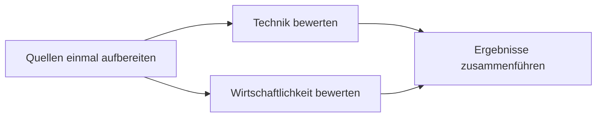

# Radian: parallele Workflows und Live-Delegation im Chat

Stand: 13. September 2026. Autorisierter Workflow-Plan. Umsetzung und überprüfte Grenzen sind im [Abnahmebericht](radian-implementation-report.md) dokumentiert. Die folgende Bestandsaufnahme beschreibt den Ausgangszustand.

Gestaltungspräzisierung: Jeder Lauf steht als eigenes, frei stehendes Symbol im Chat. Ein Klick entfaltet die verbundenen Agentensymbole ohne umgebende Box. Beschriftungen erscheinen bei Hover oder Tastaturfokus, vollständige Details bei Auswahl. Schmale weiße Lichtkanten halten die Darstellung klar.

## Umfang und Trennung

Beide Ergänzungen betreffen ausschließlich Workflows. Sie sind unabhängig vom Umbau der allgemeinen Sternenkarte und Sidebar:

1. Der Workflow-Graph beschreibt die Aufgaben, ihre Abhängigkeiten, parallele Ausführung und gemeinsam verwendete Ergebnisse.
2. Eine eigene Live-Darstellung im Chat zeigt die tatsächliche Ausführung eines konkreten gestarteten Workflows.

Die Live-Darstellung übernimmt die mathematische Bildsprache, zeigt aber nur den betreffenden Workflow-Lauf. Sie öffnet weder die allgemeine Sternenkarte noch eine andere Seite.

## Aktuell belegter Stand

- `packages/contracts/src/harnesses/schemas/workflow.ts` definiert einen sequenziellen Workflow mit Schritten, benannten Eingaben (`reads`), Ausgabeverträgen, Verbrauch und dauerhaft gespeicherten Ausführungsständen.
- `packages/agent-runtime/src/layers/harnesses/internal/workflow-runner.ts` wartet auf jeden Schritt, bevor der nächste startet. Echte parallele Ausführung fehlt in diesem Workflow-Ausführer.
- Bereits vorhanden sind validierte Ergebnisübergaben und die Weitergabe der ausdrücklich gelesenen Schrittergebnisse. Beim Fortsetzen werden abgeschlossene Schritte übersprungen. Diese Funktionen bilden die Grundlage für Wiederverwendung.
- `packages/web/src/features/harnesses/pages/workflow-run-page.tsx` zeigt einen Lauf als geordnete Schrittliste. Ausführungszustände, Ergebnisse und Verbrauch sind vorhanden; die Darstellung macht parallele Zweige noch nicht sichtbar.

Das ist eine Prüfung des vorhandenen Codes, keine Abnahme eines parallelen Workflows in der App.

## 1. Workflow-Graph: Arbeit aufteilen und Ergebnisse teilen

### Darstellung beim Planen

Ein Knoten steht für eine klar abgegrenzte Aufgabe mit zuständigem Agenten, benötigten Eingaben und einem benannten Ergebnis. Verbindungen erklären, welches Ergebnis oder welche Voraussetzung der nächste Schritt benötigt. Unabhängige Zweige liegen nebeneinander; gemeinsame Voraussetzungen und Zusammenführungen sind unmittelbar sichtbar.

Beispiel:

Nach A können B und C gleichzeitig laufen. Beide erhalten dasselbe vorbereitete Ergebnis aus A. D wartet auf beide validierten Ergebnisse. A wird dafür einmal ausgeführt.

Die Darstellung unterscheidet geplante Parallelität von tatsächlich laufenden Aufgaben. Ein ausführungsbereiter Schritt kann beispielsweise auf freie Kapazität warten. Der Grund steht am Schritt. Verbindungen zeigen bei Auswahl das übergebene Ergebnis; eine gemeinsam genutzte Ausgabe erhält einen knappen Hinweis wie „von 2 Schritten verwendet“.

### Tatsächliche Ausführung

- Der Workflow-Ausführer startet bereite Schritte anhand erfüllter Abhängigkeiten bis zur eingestellten Parallelitätsgrenze. Eine reine Reihenfolge im Array darf unabhängige Aufgaben nicht künstlich nacheinander ausführen.
- Datenabhängigkeiten und zusätzliche Ausführungsbedingungen werden ausdrücklich gespeichert. Fehlende Eingaben, ungültige Referenzen und Zyklen werden vor dem Start gemeldet. Für diese erste Erweiterung bleibt der Graph azyklisch.
- Ein Schritt erhält einen klaren Auftrag und die benötigten validierten Ergebnisse. Mehrere Verbraucher referenzieren dieselbe gespeicherte Ausgabe; dafür wird der erzeugende Schritt nicht erneut gestartet.
- Der Zustand liegt dauerhaft pro Schritt vor. Logische Aufgabenidentität und Wiederholungsversuch bleiben unterscheidbar. Gleichzeitige Fertigstellungen und erneute Ereignisse dürfen weder Ergebnisse überschreiben noch eine Aufgabe doppelt einplanen.
- Nach Unterbrechung wird laufende Arbeit abgeglichen, bevor sie erneut gestartet werden darf. Bei unklarem Ausgang externer Aktionen wird keine automatische Wiederholung angenommen.
- Gemeinsam schreibende Aufgaben werden nur bei gesicherter Trennung parallel ausgeführt. Getrennte Arbeitskopien oder eine ausdrücklich exklusive Schreibphase verhindern konkurrierende Änderungen; eine notwendige Zusammenführung ist ein eigener Schritt.
- Scheitert ein Zweig, warten seine abhängigen Aufgaben. Andere bereits laufende, unabhängige Zweige dürfen im festgelegten Budget abschließen. Zusammenführungen starten nur mit den vereinbarten gültigen Eingaben. Abbruch stoppt neue Starts und signalisiert laufenden Schritten den Abbruch.
- Parallele Starts berücksichtigen die gemeinsame Kapazität und das verbleibende Budget einschließlich laufender Arbeit. Die momentane sequenzielle Kostenprüfung muss dafür angepasst werden. Verbrauch und mögliche Abrechnungsverzögerungen bleiben sichtbar.

### Zeit und Tokens verständlich zeigen

Parallelität kann die Wartezeit verkürzen. Tokenverbrauch sinkt durch weniger doppelte Arbeit und gezielte Ergebnisübergaben; Parallelität allein garantiert keine Einsparung.

Gezeigt werden reale Laufzeit, gleichzeitig aktive Aufgaben, tatsächlich erfasster Verbrauch und mehrfach verwendete Ergebnisse. Fehlende Verbrauchswerte bleiben als unvollständig erkennbar. Eine geschätzte Restzeit oder Zeitersparnis erscheint erst bei brauchbaren Laufzeitdaten mit klar gekennzeichneter Vergleichsbasis. Es gibt keinen erfundenen Zähler für „gesparte Tokens“.

Wiederverwendung bezieht sich zunächst auf denselben Workflow-Lauf und dessen unveränderte Eingaben. Eine Wiederverwendung zwischen verschiedenen Läufen wäre eine eigene Erweiterung mit Prüfung von Eingaben, Versionen und Gültigkeit. Ähnlich formulierte Aufgaben werden nicht automatisch gleichgesetzt.

## 2. Live-Delegation: ein Workflow-Lauf als eigener Chat-Eintrag

Sobald der Server den Start bestätigt, erscheint an dieser Stelle im auslösenden Chat ein kompakter Workflow-Eintrag. Er bleibt über seine Lauf-ID mit genau dieser Ausführung verbunden und aktualisiert sich dort. Mehrere gestartete Workflows erhalten jeweils einen eigenen Eintrag.

### Bildsprache und Ablauf

1. Das Symbol des tatsächlich beauftragenden Orchestrators erscheint mit Workflow-Name und Aufgabe.
2. Bei bestätigter Delegation läuft ein kurzer weißer Impuls zu den zuständigen Agentensymbolen. Parallel gestartete Zweige werden gleichzeitig aktiv.
3. Laufende Aufgaben zeigen eine ruhige, für ihr Symbol passende Bewegung. Wartende Aufgaben tragen den konkreten Wartegrund. Ein geplanter oder auf Kapazität wartender Schritt wird nicht als arbeitend animiert.
4. Beim erfolgreichen Abschluss wird das Ergebnis am Schritt sichtbar. Ein kurzer Übergabeimpuls zu freigegebenen Nachfolgern macht den Zusammenhang verständlich. Mehrere Verbindungen können auf dieselbe Ausgabe verweisen.
5. Nach Abschluss geht der Eintrag in einen ruhigen Ergebniszustand über. Er bleibt im Chat erhalten und kann manuell eingeklappt oder für Details geöffnet werden. Fehler bleiben am betroffenen Zweig sichtbar.

Die Darstellung zeigt echte Statusänderungen. Eine Animation hält Ausführung, Antwort oder Ergebnisanzeige niemals auf. Zahlenpartikel sind dekorative Übergänge und verdecken keine Aufgabenbeschriftung.

### Bedienung

- Anfangs sichtbar ist eine kompakte Vorschau des Laufs mit laufenden Zweigen und Status. Dichte Graphen lassen sich innerhalb desselben Chat-Eintrags erweitern und erkunden.
- Eine kurze Zeile kann beispielsweise „2 laufen · 1 wartet auf Ergebnisse“ anzeigen. Fertige Aufgaben, Wartegründe und Verbrauch sind abrufbar.
- Ein Klick auf eine Aufgabe öffnet deren Auftrag, übergebene Eingaben, Ergebnis oder Fehler direkt im Eintrag. Das Agentengespräch wird nur über eine ausdrückliche Aktion geöffnet.
- Lesen und Schreiben im Chat bleiben möglich. Neue Zustände verändern weder die Route noch die aktuelle Leseposition. Ein geöffnetes Detail klappt beim Abschluss nicht selbstständig zu.
- Beim Wiederöffnen des Chats wird der gespeicherte Stand dargestellt. Historische Delegationen werden nicht erneut als gerade geschehen abgespielt. Bei fehlender Verbindung steht „Letzter Stand …“; ein Aktivitätseffekt behauptet dann keine Live-Ausführung.
- Reduzierte Bewegung und die eingeklappte beziehungsweise nicht sichtbare Darstellung pausieren Partikeleffekte. Beschriftungen und Status bleiben ohne Animation verständlich.

### Gemeinsame technische Basis der beiden Workflow-Funktionen

Der Workflow-Graph und sein Chat-Eintrag verwenden dieselbe eingefrorene Workflow-Definition, Schritt-IDs, Lauf-ID und serverseitigen Ereignisse. Layout und Symbole können gemeinsam genutzt werden; der Planungszustand und der tatsächliche Laufzustand bleiben getrennt.

Der Chat-Eintrag wird am gespeicherten Startereignis verankert und anhand der Lauf-ID aktualisiert. Er wird nicht bei jeder Abfrage als neue Nachricht angehängt. Ein Ereignisstrom beziehungsweise eine zentrale Aktualisierung liefert den Stand; nach Verbindungsabbrüchen wird mit dem gespeicherten Lauf abgeglichen. Rohtranskripte werden nur bei Bedarf geladen.

## Umsetzung und Abnahme

1. Abhängigkeiten und Darstellung im Workflow-Graph ergänzen; gemeinsame Ausgaben und geplante parallele Zweige verständlich zeigen.
2. Dauerhafte Ausführung bereiter Schritte, begrenzte Parallelität, sichere Ergebnisübergaben und Fortsetzung umsetzen.
3. Den eigenen Live-Eintrag im Chat an echte Workflow-Ereignisse anbinden und anschließend die Delegationsanimation ergänzen.

Beide Workflow-Ergänzungen werden separat vom Sternenkarten-/Sidebar-Plan geführt. Die bereits priorisierten Chat- und `/goal`-Darstellungsfehler bleiben bestehen.

Abnahmebeispiel ist der oben dargestellte verzweigte Workflow: A startet genau einmal; B und C überlappen bei ausreichender Kapazität tatsächlich; D startet nach beiden gültigen Ergebnissen. Die Darstellung muss denselben Verlauf zeigen. Zusätzlich geprüft werden Kapazität eins, ein fehlgeschlagener Zweig, Budgetgrenze, Schreibkonflikte, Abbruch, Wiederverbindung, Fortsetzung und mehrere Workflows im selben Chat. Ein erfolgreich abgeschlossener Vorgänger wird beim Fortsetzen nicht erneut ausgeführt.
